# SuperNova: A Persistent Agent Runtime for Autonomous Coordination

SuperNova 是一個專為長期任務設計的 **AI Runtime (執行時)**。它運行於 **Bun** 高性能環境，旨在探索如何讓 AI Agent 在處理複雜、跨領域且具備長期目標的任務時，透過架構上的解耦與事件驅動來解決 **Context Drift (上下文漂移)** 與 **Goal Drift (目標偏移)** 問題。

> **快速掌握架構**：請優先閱讀 [docs/ARCH.md](docs/ARCH.md) 以獲取最新的系統設計藍圖、通訊協議與角色分工詳情。
> 
> **專案前身**：[Proj.Nova](https://github.com/yan-930521/Proj.Nova/)

## 🌟 核心架構亮點 (Key Features)

*   **AgentManager 與三層 Agent 體系**：
    *   `AgentManager`：統一掌管所有 Agent 的靜態實例化與狀態脫水/喚醒 (Dehydrate & Rehydrate)。
    *   `MainAgent` (中樞與情感大腦)：系統的最高決策中心，負責與人類自然交流。具備動態情緒引擎，並能將 `EmbodiedAgent` 認知為自己在物理世界的真實身軀。對於繁瑣運算，她會主動進行上下文隔離。
    *   `TaskAgent` (領域戰術核心層)：無情的任務執行機器。負責解題、代碼審查與解析大檔案 (<Pointer>)。透過接收 `send_message` 任務並在獨立的 Git Worktree 隔離環境中運算，確保主大腦的思緒敏捷不被 Token 淹沒。支援分身併發模式 (Auto-Concurrency)。
    *   `EmbodiedAgent` (物理與感知神經)：主大腦在物理世界 (如 Minecraft) 中的實體手腳與感官。支援「意識投影 (Consciousness Projection)」，能被主大腦直接接管，共享歷史記憶與工具進行物理操作。
*   **非同步事件總線 (EventBus) 與排程**：
    *   全面捨棄同步等待。Agent 透過 `send_message` 發佈任務後即主動掛起休眠，由 EventBus 依賴關係自動流轉與分發，節省 Token 與 CPU。
    *   **高可靠與安全隔離**：EventBus 支援 `sessionId` 會話租戶隔離、異步 Promise 錯誤安全邊界（阻斷 reject 崩潰）、`publishAsync` 並發等待協調，以及支持 Agent 休眠喚醒的宣告式訂閱。
*   **去中心化記憶與工作區 (WorkspaceManager)**：
    *   **原生 Git 整合**：每個 Agent 與 Task 都有專屬的隔離目錄。Oplog (操作日誌) 與程式變更直接存入專屬目錄。解決併發衝突的同時，更提供了實體檔案層級的歷史回滾能力。
*   **資料持久化、狀態脫水與 Repository 倉儲模式**：
    *   **儲存解耦**：引入 Repository 模式（`ISessionRepository`、`IDataBlockRepository` 與 `IAgentStateRepository`），徹底將業務控制面與本機檔案系統解耦。
    *   **高性能 JSONL 與 Agent 隔離**：會話歷史採用 JSON Lines（JSONL）格式，支援常數時間 $O(1)$ 的極速追加寫入；所有事件歷史按 Agent 物理隔離分檔，讀取效率極佳。
    *   **Agent 狀態脫水 (Dehydrate)**：當 Agent 閒置或系統關機時，其狀態會被序列化寫入磁碟並銷毀實體，完美實現高並發下的容錯與擴展。

## 📂 目錄架構與依賴規範 (Project Directory & Boundaries)

為了保持系統的演進彈性，程式碼嚴格實行 **「內核/基礎設施與業務應用解耦」** 的單向依賴邊界規範：
*   **`src/core/` (核心與基礎設施層)**：包含內核引擎 (`RuntimeKernel`)、EventBus、持久化儲存庫，以及所有 Agent 的大腦實體（包含 `BaseAgent` 抽象類別，以及 `MainAgent`、`TaskAgent`、`EmbodiedAgent` 等核心實作）和負責統籌的 `AgentManager`。核心模組通過 `src/core/index.ts` 統一對外導出。
*   **`src/package/` (業務擴充與外掛層)**：包含特定領域的延伸應用、專案自訂邏輯或是外部系統對接適配器。
*   **依賴規則**：`src/package/` 必須且只能通過 `src/core/index.ts` 的接口引用核心功能與大腦，核心層嚴禁反向引用業務擴充層，從而保證核心底座的純粹與高內聚。

以下是 `src/core` 目錄實際程式碼結構與架構分層的映射圖：

```mermaid
graph TD
    %% 定義樣式
    classDef layer fill:#f9f9f9,stroke:#333,stroke-width:2px;
    classDef folder fill:#e1f5fe,stroke:#039be5,stroke-width:1px,stroke-dasharray: 5 5;
    classDef file fill:#ffffff,stroke:#757575,stroke-width:1px;

    %% 核心入口
    Index[src/core/index.ts<br>統一匯出邊界]:::file

    subgraph Layer1 [1. 代理與執行層 Agent & Execution Layer]
        direction TB
        subgraph DirAgent [src/core/agent/]
            direction TB
            AgentManager[AgentManager.ts<br>大腦統籌管理]:::file
            BaseAgent[BaseAgent.ts<br>基礎抽象大腦]:::file
            MainAgent[MainAgent.ts<br>主節點大腦]:::file
            TaskAgent[TaskAgent.ts<br>戰術核心大腦]:::file
            EmbodiedAgent[EmbodiedAgent.ts<br>具身智能大腦]:::file
            
            subgraph DirTool [src/core/agent/tool/]
                BaseTool[BaseTool.ts<br>工具基底]:::file
                AgentTools[AgentTools.ts<br>代理人專屬工具]:::file
                WorkspaceTools[WorkspaceTools.ts<br>工作區工具]:::file
            end
        end
        
        AgentManager --> BaseAgent
        BaseAgent --> MainAgent
        BaseAgent --> TaskAgent
        BaseAgent --> EmbodiedAgent
        BaseAgent -.-> BaseTool
    end

    subgraph Layer2 [2. 調度與事件層 Scheduling & Event Layer]
        direction TB
        subgraph DirMessaging [src/core/messaging/]
            IBus[IBus.ts<br>匯流排介面]:::file
            EventBus[EventBus.ts<br>事件匯流排實作]:::file
            DataBlock[DataBlock.ts<br>基礎資料載體]:::file
            
            IBus --> EventBus
        end
    end

    subgraph Layer3 [3. 狀態與記憶層 State & Memory Layer]
        direction TB
        subgraph DirSession [src/core/session/]
            SessionManager[SessionManager.ts<br>會話管理器]:::file
            Session[Session.ts<br>會話實體]:::file
        end
        
        SessionManager --> Session
        Session -.-> DataBlock
    end

    subgraph Layer4 [4. 系統基礎建設層 Infrastructure & Security]
        direction TB
        subgraph DirLifecycle [src/core/lifecycle/]
            RuntimeKernel[RuntimeKernel.ts<br>運行時內核中樞]:::file
            ILifecycle[ILifecycle.ts]:::file
        end
        
        subgraph DirContainer [src/core/container/]
            ComponentContainer[ComponentContainer.ts<br>DI 依賴注入容器]:::file
        end
        
        subgraph DirConfig [src/core/config/]
            ConfigLoader[ConfigLoader.ts]:::file
            Config[Config.ts]:::file
            DefaultConfig[DefaultConfig.ts]:::file
        end
        
        subgraph DirInfra [src/core/infra/]
            LogManager[LogManager.ts<br>全域日誌管理]:::file
            
            subgraph DirPersistence [src/core/infra/persistence/]
                WorkspaceManager[WorkspaceManager.ts<br>實體工作空間控制]:::file
                IRepository[IRepository.ts]:::file
                IStorageDriver[IStorageDriver.ts]:::file
            end
            
            subgraph DirTransports [src/core/infra/transports/]
                ConsoleTransport[ConsoleTransport.ts]:::file
                FileTransport[FileTransport.ts]:::file
            end
            
            LogManager --> ConsoleTransport
            LogManager --> FileTransport
        end
        
        subgraph DirUtils [src/core/utils/]
            GraphValidator[GraphValidator.ts]:::file
            IdGenerator[IdGenerator.ts]:::file
            PromptLoader[PromptLoader.ts]:::file
        end
        
        RuntimeKernel --> ComponentContainer
    end

    %% 核心跨層依賴關聯 (虛線)
    RuntimeKernel -. 初始化 .-> AgentManager
    RuntimeKernel -. 初始化 .-> SessionManager
    RuntimeKernel -. 初始化 .-> ConfigLoader
    RuntimeKernel -. 初始化 .-> LogManager
    
    BaseAgent -. 事件收發 .-> EventBus
    
    %% 匯出邊界
    DirAgent -.-> Index
    DirMessaging -.-> Index
    DirSession -.-> Index
    DirLifecycle -.-> Index
    DirContainer -.-> Index
    DirConfig -.-> Index
    DirInfra -.-> Index
    DirUtils -.-> Index
```

## ⚡ 為什麼選擇 Bun？ (Why Bun?)

為了支撐 AI Agent 的高頻、長時運行需求，我們選擇 Bun 作為核心 Runtime：
1.  **極致性能**：Bun 的啟動速度與執行效率遠超傳統 Node.js。
2.  **原生支持**：內建原生 TypeScript 支持與高效的 `bun test` 運行器。
3.  **現代化工具鏈**：快速的依賴管理與簡潔的異步處理機制，使系統保持輕量。

---
© 2026 SuperNova Project. 一個專注於系統架構與 AI 協作邏輯的開發實驗。
