# SuperNova: A Persistent Multi-Agent Runtime for Autonomous Coordination

SuperNova 是一個專為長期任務設計的 **AI Runtime (執行時)** 實驗。它運行於 **Bun** 高性能環境，旨在探索如何讓 AI Agent 在處理複雜、跨領域且具備長期目標的任務時，透過架構上的解耦來解決 **Context Drift (上下文漂移)** 與 **Goal Drift (目標偏移)** 問題。

## ⚡ 為什麼選擇 Bun？ (Why Bun?)

為了支撐 AI Agent 的高頻、長時運行需求，我們選擇 Bun 作為核心 Runtime：

1.  **極致性能**：Bun 的啟動速度與執行效率遠超傳統 Node.js，這對於需要頻繁啟動 Agent 思考循環的系統至關重要。
2.  **全能工具鏈**：內建原生 TypeScript 支持與高效的 `bun test` 運行器，大幅簡化了開發鏈路，不再需要繁瑣的 `tsc` 或 `jest` 配置。
3.  **現代化開發體驗**：原生支持 `.env`、快速的依賴管理 (`bun install`) 以及更簡潔的異步處理機制，使 SuperNova 保持輕量且易於擴展。

## 💡 核心挑戰：Communication vs. Execution

在傳統 Agent 框架中，對話紀錄 (Context) 同時承載了「人機溝通」與「工具執行細節」，這會導致：
1.  **Token 污染**：底層工具的冗長輸出會迅速耗盡 Context 窗口，淹沒原始目標。
2.  **邏輯混亂**：Agent 容易被執行過程中的技術報錯干擾，導致高層次的決策發生偏移。

**SuperNova 透過「雙層總帳」機制，將通訊狀態與執行狀態完全隔離。**

---

## 🏗️ 核心設計：SessionManager 與 TaskManager 的雙層分離

SuperNova 的 Runtime 核心由兩個對稱的管理者組成，分別維護系統的兩大生命週期：

### 1. 會話層 (SessionManager - Communication State)
*   **職責**：維護與用戶的溝通連貫性，記錄人機對話與任務的高階狀態摘要。
*   **核心**：`Session.ts`。它確保 MainAgent 始終在用戶可理解的層次上進行決策，保持 Context 的高度精煉。

### 2. 執行層 (TaskManager - Execution State)
*   **職責**：負責任務的動態規劃、並行調度以及執行路徑的維持。
*   **核心**：`TaskGraph.ts`。它記錄了所有工具呼叫的原始數據 (OpLog) 與依賴關係，支持背景異步執行。

---

## 🤖 代理架構：遞歸編排與協作 (Agentic Core)

SuperNova 的代理系統不再是單純的「腳本執行員」，而是一套具備 **遞歸能力 (Recursive Orchestration)** 的協作網絡：

-   **主代理 (MainAgent) 的多維編排能力**：
    -   **任務調度**：MainAgent 作為用戶目標的守護者，負責將高階目標提交給 `TaskManager` 進行拆解。
    -   **子代理供給 (Provisioning)**：MainAgent 具備動態建立子任務並指派專屬 `WorkerAgent` 的能力，專注於執行特定的技術動作。
    -   **同行遞歸協作 (Main-to-Main)**：這是 SuperNova 的核心特性。一個 MainAgent 可以根據任務需求，將複雜的子目標指派給另一個具備不同專業知識的 MainAgent。例如：
        -   `Research MainAgent` 負責收集資訊與制定策略。
        -   `Coder MainAgent` 負責根據策略編寫測試與實現功能。
        -   兩者透過 `TaskManager` 在同一個 `TaskGraph` 中進行非同步協作。
-   **統一執行引擎**：所有代理（無論 Main 或 Worker）均繼承自 `BaseAgent` 並內建 ReAct 思考循環，確保了全系統在行為決策上的一致性與可靠性。

---

## 🗺️ 系統架構全景圖 (Runtime System Map)

```mermaid
flowchart TD

subgraph group_runtime["Runtime core"]
  node_global_runtime["Global runtime<br/>composition root<br/>[GlobalRuntime.ts]"]
  node_session_manager["Session manager<br/>conversation state<br/>[SessionManager.ts]"]
  node_task_manager["Task manager<br/>execution state<br/>[TaskManager.ts]"]
  node_session_model["Session<br/>domain model<br/>[Session.ts]"]
  node_config["Config<br/>[Config.ts]"]
end

subgraph group_execution["Agents and tasks"]
  node_task_planner["Task planner<br/>goal decomposition<br/>[TaskPlanner.ts]"]
  node_main_agent["Main agent<br/>orchestrator agent<br/>[MainAgent.ts]"]
  node_worker_agent["Worker agent<br/>execution agent<br/>[WorkerAgent.ts]"]
  node_base_agent["Base agent<br/>agent base<br/>[BaseAgent.ts]"]
  node_task_graph["Task graph<br/>domain model<br/>[TaskGraph.ts]"]
  node_task_model["Task<br/>domain model<br/>[Task.ts]"]
end

subgraph group_support["Infra and tools"]
  node_event_bus(("Event bus<br/>coordination bus<br/>[EventBus.ts]"))
  node_mutation_validator{{"Mutation validator<br/>state guard"}}
  node_log_manager["Log manager<br/>observability<br/>[LogManager.ts]"]
  node_task_repository[("Task repo<br/>filesystem persistence")]
  node_session_repository[("Session repo<br/>filesystem persistence")]
  node_agent_repository[("Agent repo<br/>filesystem persistence")]
  node_tool_registry["Tool registry<br/>tool catalog<br/>[ToolRegistry.ts]"]
  node_core_tools["Core tools<br/>orchestration tools"]
  node_common_tools["Common tools<br/>general tools"]
  node_file_tools["File tools<br/>workspace tools"]
end

subgraph group_assets["Prompts and profiles"]
  node_prompt_assets["Prompt assets<br/>prompt library"]
  node_agent_profiles["Agent profiles<br/>agent configs"]
end

node_global_runtime -->|"loads"| node_config
node_global_runtime -->|"wires"| node_session_manager
node_global_runtime -->|"wires"| node_task_manager
node_global_runtime -->|"wires"| node_tool_registry
node_global_runtime -->|"wires"| node_event_bus
node_global_runtime -->|"wires"| node_log_manager
node_session_manager -->|"stores"| node_session_model
node_session_manager -->|"persists"| node_session_repository
node_task_manager -->|"stores"| node_task_model
node_task_manager -->|"tracks"| node_task_graph
node_task_manager -->|"persists"| node_task_repository
node_task_manager -->|"validates"| node_mutation_validator
node_task_planner -->|"produces"| node_task_graph
node_main_agent -->|"extends"| node_base_agent
node_worker_agent -->|"extends"| node_base_agent
node_main_agent -->|"plans"| node_task_planner
node_main_agent -->|"delegates"| node_worker_agent
node_main_agent -->|"uses"| node_tool_registry
node_worker_agent -->|"uses"| node_tool_registry
node_tool_registry -->|"contains"| node_core_tools
node_tool_registry -->|"contains"| node_common_tools
node_tool_registry -->|"contains"| node_file_tools
node_core_tools -->|"controls"| node_task_manager
node_core_tools -->|"reads"| node_agent_repository
node_event_bus -->|"publishes"| node_session_manager
node_event_bus -->|"publishes"| node_task_manager
node_task_manager -->|"emits"| node_event_bus
node_session_manager -->|"emits"| node_event_bus
node_agent_profiles -->|"configures"| node_main_agent
node_prompt_assets -->|"guides"| node_main_agent

click node_global_runtime "https://github.com/yan-930521/supernova/blob/main/src/runtime/GlobalRuntime.ts"
click node_session_manager "https://github.com/yan-930521/supernova/blob/main/src/manager/SessionManager.ts"
click node_task_manager "https://github.com/yan-930521/supernova/blob/main/src/manager/TaskManager.ts"
click node_task_planner "https://github.com/yan-930521/supernova/blob/main/src/task/TaskPlanner.ts"
click node_main_agent "https://github.com/yan-930521/supernova/blob/main/src/agent/MainAgent.ts"
click node_worker_agent "https://github.com/yan-930521/supernova/blob/main/src/agent/WorkerAgent.ts"
click node_base_agent "https://github.com/yan-930521/supernova/blob/main/src/agent/BaseAgent.ts"
click node_task_graph "https://github.com/yan-930521/supernova/blob/main/src/models/TaskGraph.ts"
click node_session_model "https://github.com/yan-930521/supernova/blob/main/src/models/Session.ts"
click node_task_model "https://github.com/yan-930521/supernova/blob/main/src/models/Task.ts"
click node_event_bus "https://github.com/yan-930521/supernova/blob/main/src/infra/EventBus.ts"
click node_mutation_validator "https://github.com/yan-930521/supernova/blob/main/src/infra/MutationValidator.ts"
click node_log_manager "https://github.com/yan-930521/supernova/blob/main/src/infra/LogManager.ts"
click node_task_repository "https://github.com/yan-930521/supernova/blob/main/src/infra/storage/FileSystemTaskRepository.ts"
click node_session_repository "https://github.com/yan-930521/supernova/blob/main/src/infra/storage/FileSystemSessionRepository.ts"
click node_agent_repository "https://github.com/yan-930521/supernova/blob/main/src/infra/storage/FileSystemAgentRepository.ts"
click node_tool_registry "https://github.com/yan-930521/supernova/blob/main/src/tool/ToolRegistry.ts"
click node_core_tools "https://github.com/yan-930521/supernova/tree/main/src/tool/core"
click node_common_tools "https://github.com/yan-930521/supernova/tree/main/src/tool/common"
click node_file_tools "https://github.com/yan-930521/supernova/tree/main/src/tool/file"
click node_prompt_assets "https://github.com/yan-930521/supernova/tree/main/prompts"
click node_agent_profiles "https://github.com/yan-930521/supernova/tree/main/agents"
click node_config "https://github.com/yan-930521/supernova/blob/main/src/config/Config.ts"

classDef toneNeutral fill:#f8fafc,stroke:#334155,stroke-width:1.5px,color:#0f172a
classDef toneBlue fill:#dbeafe,stroke:#2563eb,stroke-width:1.5px,color:#172554
classDef toneAmber fill:#fef3c7,stroke:#d97706,stroke-width:1.5px,color:#78350f
classDef toneMint fill:#dcfce7,stroke:#16a34a,stroke-width:1.5px,color:#14532d
classDef toneRose fill:#ffe4e6,stroke:#e11d48,stroke-width:1.5px,color:#881337
classDef toneIndigo fill:#e0e7ff,stroke:#4f46e5,stroke-width:1.5px,color:#312e81
classDef toneTeal fill:#ccfbf1,stroke:#0f766e,stroke-width:1.5px,color:#134e4a
class node_global_runtime,node_session_manager,node_task_manager,node_session_model,node_config toneBlue
class node_task_planner,node_main_agent,node_worker_agent,node_base_agent,node_task_graph,node_task_model toneAmber
class node_event_bus,node_mutation_validator,node_log_manager,node_task_repository,node_session_repository,node_agent_repository,node_tool_registry,node_core_tools,node_common_tools,node_file_tools toneMint
class node_prompt_assets,node_agent_profiles toneRose
```

---

## 🔄 執行流程 (Execution Flow)

1.  **提交目標 (Goal Submission)**：用戶輸入目標，由 `SessionManager` 建立會話並記錄初始狀態。
2.  **初始化規劃 (Planning)**：`TaskPlanner` 介入，透過 LLM 將目標拆解為里程碑。
3.  **任務動態展開 (JIT Expansion)**：根據當前里程碑，動態展開具體的任務節點並寫入任務圖。
4.  **代理指派 (Provisioning)**：`TaskManager` 根據任務需求，從 `AgentManager` 中找出適合的角色執行。
5.  **執行與記錄**：Worker 執行工具，將詳細結果存入任務狀態，並發布完成事件。
6.  **摘要回報**：系統監聽到任務完成，將該步驟的「摘要」同步回會話歷史。
7.  **反饋與迭代**：Planner 根據上一步的結果，決定下一個任務的展開方式。

---

## ⚡ 為什麼選擇 Bun？ (Why Bun?)

為了支撐 AI Agent 的高頻、長時運行需求，我們選擇 Bun 作為核心 Runtime：

1.  **極致性能**：Bun 的啟動速度與執行效率遠超傳統 Node.js，這對於需要頻繁啟動 Agent 思考循環的系統至關重要。
2.  **全能工具鏈**：內建原生 TypeScript 支持與高效的 `bun test` 運行器，大幅簡化了開發鏈路，不再需要繁瑣的 `tsc` 或 `jest` 配置。
3.  **現代化開發體驗**：原生支持 `.env`、快速的依賴管理 (`bun install`) 以及更簡潔的異步處理機制，使 SuperNova 保持輕量且易於擴展。

---

## 🛠️ 目前已實現的能力 (Runtime Capabilities)

-   **遞歸規劃工作流**：基於 LangGraph 實現了「規劃-評審-展開」的自我迭代流程。
-   **異步事件總線 (Event Bus)**：全系統透過事件進行解耦通訊。
-   **對稱式持久化系統**：User, Session, Task, Agent 模組均具備統一的儲存庫介面。
-   **全鏈路追蹤協議**：確保每一項操作都能溯源至特定的 SessionID 與 TraceID。

---

## 📅 開發進度 (Roadmap)

### 🏁 已完成 (Phase 1 & 2)
- [x] 基礎數據協議與對稱式 Manager-Repository 架構。
- [x] 具備 Zod 校驗的結構化推理引擎 (`InferenceEngine`)。
- [x] 核心編排工具集 (Dispatcher, Create, Assign)。

### 🏗️ 進行中 (Phase 3: Runtime 強化 & JIT)
- [x] **環境遷移**：全面從 Node.js 遷移至 Bun 高性能環境。
- [x] **JIT 基礎架構**：實現按里程碑動態展開任務的執行流。
- [x] **脈搏引擎 (Pulse Engine)**：實作核心心跳偵測與任務監控機制。
- [x] **JIT 自癒與重規劃 (Self-Healing)**：實作了 3x3 階梯式重試機制、認知重規劃 (Cognitive Re-planning) 以及任務上下文隔離與繼承 (Context Isolation)。
- [ ] **STUCK 狀態處理**：設計當任務鏈進入 STUCK 狀態時的後續處置機制（如人類介入 HITL 或自動降級）。
- [ ] **記憶系統 (Memory System)**：實作長短期記憶管理與 Context 壓縮。

### 📅 未來計畫
- [ ] **TailAgent (./web)**：基於 React + Tailwind 的視覺化控制面板。
- [ ] 數據庫遷移 (PostgreSQL / MongoDB / Redis)。
- [ ] 生產級容器化 (Docker)。

---
© 2026 SuperNova Project. 一個專注於系統架構與 AI 協作邏輯的開發實驗。
