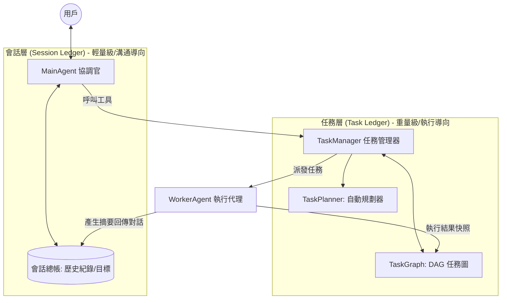

# SuperNova: Decoupled & Event-Driven AI Agent Orchestration

SuperNova 是一個基於 TypeScript 構建的高性能 AI Agent 執行時框架。它採用 **「控制與執行深度分離」** 的核心架構，透過雙層總帳機制與非同步事件驅動，為複雜任務的規劃與並行執行提供穩定、可追蹤且具備高度擴展性的運行環境。

---

## 🏗️ 核心架構 (Core Architecture)

SuperNova 採用 **雙層總帳 (Dual-Ledger)** 設計，明確區分溝通邏輯與執行狀態：



### 1. 會話層 (Session Ledger)
*   **職責**：維護與用戶的溝通連貫性。
*   **內容**：儲存用戶原始目標、對話歷史、負責代理資訊。
*   **特性**：異步更新，當後台任務產生摘要時，會自動同步回會話歷史。

### 2. 任務層 (Task Ledger)
*   **職責**：確保執行路徑的可靠性與可追溯性。
*   **內容**：儲存任務依賴拓撲 (DAG)、節點狀態、詳細工具輸入/輸出快照。
*   **特性**：持久化紀錄，任務完成後仍保留在圖中。

---

## 🚀 關鍵特性 (Key Features)

### 🤖 智慧代理系統 (Agentic Core)
*   **統一 ReAct 執行**：所有代理皆繼承自 `BaseAgent`，內建強大的 ReAct 推理循環。
*   **遞歸編排模型**：支援「代理指派代理」，MainAgent 類型可被當作 Worker 調用執行複雜子任務。
*   **對話式 Worker**：Worker Agent 能根據其 **身份 (Identity)** 產生具備共情或專業特徵的執行摘要。
*   **動態工具箱**：支援在運行時動態註冊與調用工具，工具執行環境具備安全等級劃分。

### 📊 任務編排引擎 (Task Orchestration)
*   **智慧規劃**：`TaskPlanner` 自動將目標拆解為里程碑與任務依賴圖。
*   **混合驅動模式**：支援全自動調度與手動精細控制（`task_create`, `task_assign`）。
*   **競態防禦**：原子化指派機制，防止通用執行員搶佔特定領域任務。

### 🔍 全鏈路觀測 (Observability)
*   **型別嚴謹協議**：全系統強制使用 `IAgentExecuteContext` 與 `IAgentExecuteResult`。
*   **沙盒路徑自動化**：檔案操作自動映射至 `workspace/`，具備逃逸攔截與重複前綴過濾。
*   **結構化日誌系統**：即時輸出 `.jsonl` 格式日誌，詳盡記錄執行路徑。

---

## 🛠️ 工具箱 (Toolbox)

系統預裝了一系列核心工具，供代理在執行過程中使用：

| 工具名稱 | 安全等級 | 核心功能 |
| :--- | :--- | :--- |
| `task_dispatcher` | TIER_2 | 提交高階目標，觸發自動規劃與執行流。 |
| `task_create` | TIER_2 | 建立單一任務節點，支援指定依賴與執行 Agent。 |
| `task_assign` | TIER_2 | 手動將特定任務指派給白名單內的 Agent。 |
| `task_list` | TIER_1 | 獲取當前任務鏈狀態或特定鏈下的任務細節。 |
| `task_info` | TIER_1 | 查詢特定任務的詳細結果與產出數據。 |
| `agent_list` | TIER_1 | 列出當前代理有權管轄的專家列表。 |
| `web_search` | TIER_1 | 透過 Tavily API 獲取即時網路資訊。 |

---

## 🚦 快速開始 (Quick Start)

### 1. 安裝與配置
```bash
npm install
# 配置 .env 檔案填入 OPENAI_API_KEY
```

### 2. 啟動對話 Demo
體驗具備共情能力的諮商師或資深研究員：
```bash
npx ts-node scripts/chat-demo.ts
```

---

## 📅 發展路徑 (Roadmap)

- [x] **核心架構重構**：雙層總帳與異步事件驅動落地。
- [x] **遞歸代理模型**：實現多級 MainAgent 調度與統一 `execute` 接口。
- [x] **型別與安全加固**：統一 Context 協議與沙盒逃逸防禦機制。
- [x] **工具層測試覆蓋**：核心編排與檔案工具單元測試達成 100% 通過。
- [ ] **多輪動態重新規劃**：強化執行失敗後的自動自癒與路徑修正。
- [ ] **長期記憶系統 (RAG)**：整合向量資料庫實現 Agent 記憶延續。
