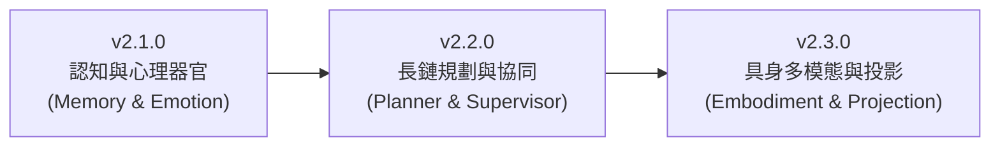

# SuperNova 專案開發藍圖 (Roadmap)

本文件概述了 SuperNova（基於 TS/Bun 的自主多代理人執行架構）近期的核心里程碑、現階段架構進展與未來演進願景。

---

## 當前版本進展：v2.0.0 - 組合式代理人核心與微內核架構 (已完成)

SuperNova 確立了「一切皆器官 (Everything is an Organ)」的組合式架構體系，徹底以純容器 `UniversalAgent` 取代階層繼承樹，完成了核心基礎設施的全面模組化：

### 核心技術亮點 (Technical Highlights)
1. **組合式代理核心 (Composable Universal Agent)**
   - **極簡宿主容器**：`UniversalAgent` 純容器程式碼小於 400 行，零業務邏輯，僅專注於狀態機調度與標準推理步驟迴圈 (BeforeStep → BuildPrompt → CollectTools → CallModel → AfterStep)。
   - **器官介面與生命週期 (`IAgentModule`)**：模組具備獨立優先級 (`priority`)、依賴校驗 (`requires`) 與排斥衝突檢驗 (`conflicts`)。
   - **動態提示詞組裝引擎**：定義 `PromptSectionIndex` (1~10) 嚴格階層索引，實現跨模組提示詞片段的雙鍵排序自動組裝。
2. **通訊與會話子系統 (Messaging & Session Subsystem)**
   - **兩段式大資料卸載 (Two-Tier Offload)**：新訊息落盤門檻 (2KB) + 舊歷史滑動窗口深度壓縮門檻 (512B)，超過門檻自動轉存為獨立 Blob 檔案並以 URI 參照替代。
   - **會話重啟復原機制 (Session Recovery)**：系統優雅停機時將活躍會話切換為 `SUSPENDED` 落盤，開機時 `SessionManager.start()` 主動批次載入並解凍恢復為 `ACTIVE`。
   - **收件箱即時釋放與持久化同步**：`popInbox` 取出後徹底自記憶體釋放鍵值，並即刻非同步觸發會話存檔，杜絕重啟重複消費。
3. **微內核基礎設施 (@supernova/runtime & @supernova/events)**
   - **合一生命週期管理**：五階段狀態機、服務容器池、實例去重保護與逆序優雅停機 (Reverse Order Shutdown)。
   - **泛型強型別事件總線**：跨子系統完全解耦，覆蓋系統、會話、代理與步驟 Hook 鏈。
   - **嚴格型別配置**：徹底淘汰 Zod `.passthrough()`，手動嚴格型別化模型推理參數 (`reasoning`, `parallel_tool_calls`, `service_tier`)。
4. **完整架構文檔體系**：於 `docs/` 重建涵蓋全域架構總覽 (`ARCH.md`) 與 20+ 篇模組化規格文檔。

---

## 未來里程碑藍圖 (Future Milestones)

### v2.1.0 - 記憶與認知心理器官 (Cognitive Organs) - 進行中 (50%)
- **長期圖譜與向量記憶器官 (`MemoryModule`, priority: 20)** [已完成]：
  - **知識圖譜記憶 (Graph Memory)**：以低成本 `EXTRACTION` Preset 在背景非同步抽取實體 (Entities) 與關係三元組 (Subject-Predicate-Object)，並持久化至 `nodes.json` 與 `edges.json`。
  - **向量語意檢索與子圖拓撲展開**：結合 OpenAI Embeddings 與 Vectra 本地向量索引庫，實現向量相似檢索與一階/多階子圖拓撲召回 (`searchGraphContext`)，於思考前自動注入 `PromptSectionIndex.MEMORY_CONTEXT (3)`。
  - **主動召回工具 (`recall_memory`)**：提供模型推理思考時主動查詢長程記憶與使用者偏好的標準 Tool。
  - **端到端實機測試腳本**：重構 `demo/test_memory.ts`，五階段完整驗證抽取、向量化、子圖檢索與工具召回。
- **認知心理與情緒器官 (`EmotionModule`, priority: 30)** [🔄 待開發]：
  - **OCC 情感模型與 VAD 向量**：維護 Valence (愉悅度)、Arousal (激動度)、Dominance (主導度) 與內部壓力值。
  - **半衰期情感衰減**：依據時間流逝自然趨向基礎性格心境。
  - **多模態同步**：透過 EventBus 廣播情緒變更事件，支援 UI 表情與語音合成音色動態調整。

### v2.2.0 - 樹狀規劃與多代理協同 (Orchestration & Planning)
- **目標分解與樹狀規劃器官 (`PlannerModule`, priority: 40)**：
  - **LATS (Language Agent Tree Search)**：實作蒙地卡羅樹狀搜尋、候選路徑展開、數值化自我評估與錯誤回溯剪枝。
  - **動態進度注入**：將當前執行清單注入 `PromptSectionIndex.PLANNER_STATE (6)`。
- **多代理監督與授權器官 (`SupervisorModule`, priority: 40)**：
  - **動態特權審查**：審核下轄 Worker 代理人之高風險操作並簽發一次性 Token。
  - **子任務動態委派**：依據任務標籤匹配適任 Worker 代理人，並進行成果品質驗收。
- **任務執行工作者器官 (`TaskWorkerModule`, priority: 60)**：
  - **TaskDAG 節點對接**：專注執行具體工程節點並向調度器回報進度與產生物件。

### v2.3.0 - 具身多模態與意識投影 (Embodiment & Projection)
- **具身互動與環境感知器官 (`EmbodimentModule`, priority: 70)**：
  - **實體與虛擬沙盒適配器**：串接外部物理感測器、數位 OS 桌面或 Minecraft 沙盒環境。
  - **環境感知注入**：將周遭實體座標與狀態注入 `PromptSectionIndex.ENVIRONMENT (7)`。
- **意識投影與器官借用通道 (`ProjectionModule`, priority: 50)**：
  - **心智鏡像 (Mind Mirroring)**：主意識核心跨會話將性格語調投射至邊緣輕量節點。
  - **非對稱器官借用**：邊緣節點按需借用核心代理人之長期記憶與高階推論能力。

---

## 歷史里程碑回顧 (Archive)

<b>點擊展開檢視歷史里程碑 (v0.1.0 - v0.2.3)</b>

### v0.1.0 - Foundation & Memory System (已完成)
- **圖向量混合記憶**：實作長期記憶 (Graph Memory)、情節記憶 (Episodic Memory) 與動態上下文檢索 (Dynamic Context Injection)。
- **底層架構與配置**：Zod 動態配置引擎、工作區隔離沙盒、非同步 EventBus。
- **效能與穩健性**：歷史壓縮短路機制 (`isOffloaded`)、通用 LRUCache、歷史檔案安全切片讀取保護。
- **代理人與會話管理**：會話層 Projection State、無狀態執行模式、透明化 ReAct 思考循環。

### v0.2.0 - 虛擬具身智能與自主進化 (Virtual Embodied AI & Autonomous Evolution) (已完成)
- **虛擬具身智能**：`BaseEmbodiedEnv` 多代理環境抽象層、技能執行會話實體隔離、泛型化外部環境 SDK。
- **CodeSkill 自我進化生態系**：程式碼自我編寫與修復閉環、動態版號與指標儲存、LRU 淘汰鉤子 (`onEvict`)、自我修復快取作廢與自動退版。
- **具象化 Task 系統**：LATS 策略搜尋引擎、非同步事件排程、任務儀表板動態注入、`SpawnAgentTool` 與 `AssignTaskTool` 自動化調度閉環。
- **進階工作區協同**：步驟級 Git 暫存隔離、多代理人衝突處理。
- **動態工具分配**：ToolRegistry 實例化生命週期反轉控制、免洗代理人 (`isTemp: true`) 自動釋放。
- **底層領域架構升級**：Clean Architecture 目錄重構、萃取純粹 domain 層、扁平化 infra。

### v0.2.3 - Novalink 通訊與環境輕量化重構 (已完成)
- **Novalink 雙向通訊**：單一 WebSocket 連線搭配 JSON-RPC 2.0，實現全雙工低延遲通訊；物理運算與尋路演算卸載至後端伺服器。
- **介面抽象與型別安全隔離**：導入 `IBody` 介面，統一命名規範；產出純淨之 `NovaLink.d.ts` 避免動態注入時產生型別幻覺。

