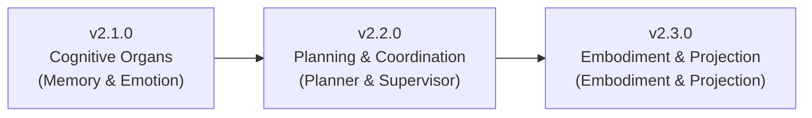

# SuperNova Development Roadmap

This document outlines key milestones, architectural progress, and future evolutionary goals of the SuperNova AI Agent Runtime.

---

## Current Version Progress: v2.0.0 - Composable Agent Core & Micro-Kernel Architecture (Completed)

SuperNova has established the "Everything is an Organ" composable architecture, completely replacing class hierarchies with the pure host container `UniversalAgent` and achieving full modularization of core infrastructure:

### Technical Highlights
1. **Composable Universal Agent**
   - **Minimal Host Container**: `UniversalAgent` is under 400 lines of code with zero business logic, dedicated purely to state machine coordination and the standard step loop (BeforeStep → BuildPrompt → CollectTools → CallModel → AfterStep).
   - **Organ Interface & Lifecycle (`IAgentModule`)**: Modules possess isolated execution priorities (`priority`), dependency verification (`requires`), and conflict assertions (`conflicts`).
   - **Dynamic Prompt Engine**: Strict hierarchical index (`PromptSectionIndex` 1~10) facilitating dual-key sorting and dynamic assembly of modular prompt sections.
2. **Messaging & Session Subsystem**
   - **Two-Tier Offload**: Real-time disk write threshold for incoming messages (2KB) + deep sliding window compaction threshold for older history (512B). Large payloads are automatically offloaded to independent Blob files referenced by URI.
   - **Session Recovery**: Suspends active sessions to disk as `SUSPENDED` upon shutdown; automatically restores and unfreezes them back to `ACTIVE` in batch upon `SessionManager.start()`.
   - **Inbox Buffer Memory Release & Persistence Sync**: Thoroughly frees keys from memory Map upon `popInbox` and immediately persists changes, preventing duplicate message processing on recovery.
3. **Micro-Kernel Infrastructure (@supernova/runtime & @supernova/events)**
   - **Unified Lifecycle Management**: 5-stage state machine, service container pool, deduplication protection, and reverse-order graceful shutdown.
   - **Strongly-Typed Generic EventBus**: Completely decouples cross-subsystem interactions covering system, session, agent, and step hook chains.
   - **Strict Typing Configuration**: Deprecates Zod `.passthrough()`, manually asserting strict types on LLM parameters (`reasoning`, `parallel_tool_calls`, `service_tier`).
4. **Complete Architecture Documentation**: Rebuilt global system overview (`ARCH.md`) and 20+ modular specification documents in `docs/`.

---

## Future Milestones

### v2.1.0 - Cognitive & Psychological Organs - In Progress (50%)
- **Long-Term Graph & Vector Memory Organ (`MemoryModule`, priority: 20)** [✅ Completed]:
  - **Knowledge Graph Memory (Graph Memory)**: Employs a low-cost `EXTRACTION` preset to asynchronously extract entities and relation triplets (Subject-Predicate-Object) in the background, persisting to `nodes.json` and `edges.json`.
  - **Semantic Vector Search & Subgraph Expansion**: Combines OpenAI Embeddings with local Vectra vector store for similarity retrieval and multi-hop subgraph context injection (`searchGraphContext`) into `PromptSectionIndex.MEMORY_CONTEXT (3)` before thinking.
  - **Active Recall Tool (`recall_memory`)**: Standard Tool enabling models to actively query long-term facts, entity attributes, and user preferences during reasoning.
  - **End-to-End Demo Script**: Overhauled `demo/test_memory.ts`, validating extraction, vectorization, subgraph retrieval, and tool recall across 5 phases.
- **Cognitive Emotion & Psychology Organ (`EmotionModule`, priority: 30)** [🔄 Pending]:
  - **OCC Emotion Model & VAD Vector**: Maintains Valence, Arousal, Dominance, and internal Stress levels.
  - **Exponential Emotional Decay**: Naturally decays extreme emotional fluctuations towards the baseline temperament over time.
  - **Multimodal Synchronization**: Broadcasts emotion change events via EventBus for UI expression and TTS voice modulation.

### v2.2.0 - Tree Search Planning & Multi-Agent Coordination (Orchestration & Planning)
- **Goal Decomposition & Planning Organ (`PlannerModule`, priority: 40)**:
  - **LATS (Language Agent Tree Search)**: Implements Monte Carlo tree search, candidate rollout, numerical self-evaluation, and back-tracking pruning.
  - **Dynamic State Injection**: Injects current execution checklist into `PromptSectionIndex.PLANNER_STATE (6)`.
- **Supervisory & Authorization Organ (`SupervisorModule`, priority: 40)**:
  - **Dynamic Privilege Review**: Audits high-risk operations of subordinate worker agents and issues one-time capability tokens.
  - **Subtask Delegation**: Dynamically matches capable worker agents based on task tags and validates delivery quality.
- **Task Worker Organ (`TaskWorkerModule`, priority: 60)**:
  - **TaskDAG Node Execution**: Focuses on executing concrete engineering nodes and reporting progress and artifacts to the dispatcher.

### v2.3.0 - Embodied Multimodality & Consciousness Projection (Embodiment & Projection)
- **Embodied Perception & Sandbox Organ (`EmbodimentModule`, priority: 70)**:
  - **Physical & Virtual Sandbox Adapters**: Interfaces with external physical sensors, desktop OS, or Minecraft game sandboxes.
  - **Environment Perception Injection**: Injects nearby entity coordinates and state changes into `PromptSectionIndex.ENVIRONMENT (7)`.
- **Consciousness Projection & Organ Borrowing Channel (`ProjectionModule`, priority: 50)**:
  - **Mind Mirroring**: Projects core personality and tone across sessions to lightweight edge nodes.
  - **Asymmetric Organ Borrowing**: Edge nodes borrow long-term memory and high-tier reasoning capabilities from the core agent on demand.

---

## Historical Milestones Archive

<b>Click to expand historical milestones (v0.1.0 - v0.2.4)</b>

### v0.1.0 - Foundation & Memory System (Completed)
- **Hybrid Graph-Vector Memory**: Long-term graph memory, episodic daily summaries, and dynamic context injection.
- **Underlying Infrastructure & Config**: Zod dynamic configuration engine, workspace isolation sandbox, asynchronous EventBus.
- **Performance & Robustness**: History compression short-circuit (`isOffloaded`), universal LRUCache, safe history slicing protection.

### v0.2.0 - Embodied Agent Self-Evolving CodeSkill Ecosystem (Completed)
- **Embodied AI**: `BaseEmbodiedEnv` multi-agent environment abstraction, session-level skill cache isolation, generic external SDKs.
- **CodeSkill Self-Evolution**: Dynamic versioning and indirection pointer storage, LRU cache eviction hooks (`onEvict`), self-healing invalidation and rollback.
- **Task System**: LATS planning search engine, async task scheduling, dynamic task dashboard injection.

### v0.2.3 - Novalink Bi-Directional Communication (Completed)
- **Novalink**: Single WebSocket connection with JSON-RPC 2.0 full-duplex communication; offloaded physics to backend.
- **Type Declaration Isolation**: Pure `NovaLink.d.ts` without module syntax, minimizing hallucinations in LLMs.

### v0.2.4 - String Array RBAC & Global Feature Flags (Completed)
- **Fine-Grained Permissions**: String-based `AgentPermissions`, two-stage privilege verification in tools.
- **App Facade & Graceful Shutdown**: `SuperNovaApp` facade class unifying lifecycle and SIGINT/SIGTERM handling.

