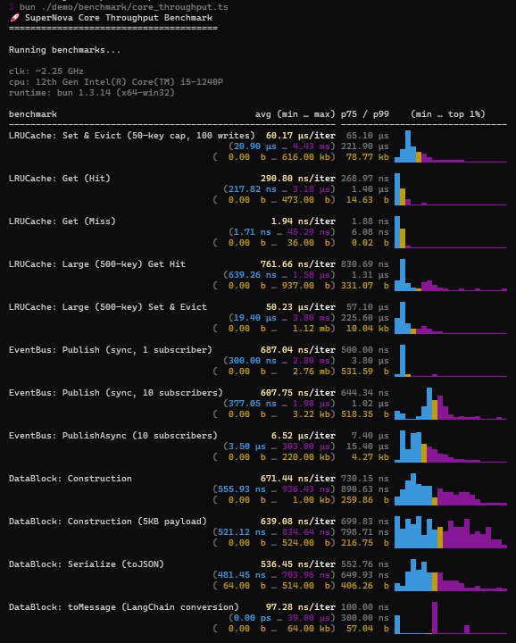
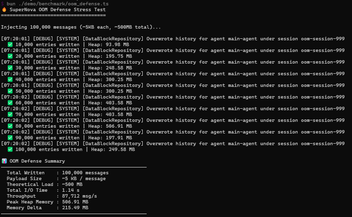

# SuperNova Performance Benchmark Report

This document records the performance test results of SuperNova's core infrastructure.

**Test Environment**: 12th Gen Intel(R) Core(TM) i5-1240P / Windows 11 / Bun 1.3.14

---

## How to Run

```bash
# Core throughput benchmark (LRUCache, EventBus, DataBlock)
bun run bench:core

# OOM defense stress test (100k × 5KB massive history writes)
bun run bench:oom
```

---

## 1. Core Throughput

Benchmarking tool: [mitata](https://github.com/evanwashere/mitata)

### Test Items

| Category | Test Name | Description |
|:---|:---|:---|
| **LRUCache** | Set & Evict (50-key) | Write 100 keys into a 50-capacity cache, triggering eviction |
| **LRUCache** | Get (Hit / Miss) | Read latency on cache hit vs miss |
| **LRUCache** | Large (500-key) | Simulates SkillManager-scale large cache reads/writes |
| **EventBus** | Publish (1 / 10 subscribers) | Sync broadcast to varying subscriber counts |
| **EventBus** | PublishAsync | Async broadcast, awaiting all handler resolutions |
| **DataBlock** | Construction | Time to construct a standard message carrier |
| **DataBlock** | Serialize (toJSON) | JSON serialization performance |
| **DataBlock** | toMessage | Conversion to LangChain Message format |

### Results



### Data Summary

#### LRUCache

| Test | Avg Latency | Est. Throughput |
|:---|:---|:---|
| Set & Evict (50-key, 100 writes) | 60.17 µs / iter | ~0.60 µs/key |
| Get (Hit) | 290.80 ns | ~3.43M ops/s |
| Get (Miss) | 1.94 ns | ~510M ops/s |
| Large (500-key) Get Hit | 761.66 ns | ~1.31M ops/s |
| Large (500-key) Set & Evict | 50.23 µs / iter | ~0.50 µs/key |

- Large (500-key) Get Hit is approximately 2.6x slower than the 50-key version. The stored values are objects containing 200-char strings, which incur higher V8 object addressing overhead compared to plain strings.

#### EventBus

| Test | Avg Latency | Est. Throughput |
|:---|:---|:---|
| Publish (sync, 1 subscriber) | 687.04 ns | ~1.45M ops/s |
| Publish (sync, 10 subscribers) | 607.75 ns | ~1.64M ops/s |
| PublishAsync (10 subscribers) | 6.52 µs | ~153K ops/s |

- PublishAsync shows approximately 10x higher latency than sync, attributable to Promise creation and await overhead.

#### DataBlock

| Test | Avg Latency |
|:---|:---|
| Construction | 671.44 ns |
| Construction (5KB payload) | 639.08 ns |
| Serialize (toJSON) | 536.45 ns |
| toMessage (LangChain conversion) | 97.28 ns |

---

## 2. OOM Defense Stress Test

### Methodology

Flood `FileSystemDataBlockRepository` with **100,000** historical dialogue entries, each with a ~**5KB** payload, creating a theoretical memory pressure of ~**500MB**.

### Results



### Data Summary

| Metric | Value |
|:---|:---|
| Total Written | 100,000 entries × ~5KB |
| Theoretical Memory Pressure | ~500 MB |
| Peak Heap | 506.91 MB (at 80,000 entries) |
| Final Heap | 249.58 MB (after all 100,000 entries) |
| Total Duration | 1.14 seconds |
| Throughput | 87,712 msg/s |

#### Memory Trajectory

```text
Entries   10k     20k     30k     40k     50k     60k     70k     80k     90k    100k
Heap MB   94  →  196  →  249  →  300  →  300  →  404  →  404  →  507  →  198  →  250
                                                                  ↑ GC reclaim
```

- Peak occurs at 80,000 entries (506.91 MB).
- At 90,000 entries, V8 Garbage Collection (GC) intervenes, dropping the heap abruptly to 197.91 MB.
- **Why does the peak briefly exceed the theoretical value?** At extreme throughputs (87,712 msg/s, completing in just 1.14 seconds), object allocation far outpaces V8's default GC rhythm. While the system's defense mechanisms have already released old object references, V8's lazy GC defers the actual cleanup until memory pressure hits a specific threshold. The immediate plummet in heap size upon GC triggering proves that no memory leaks exist in the system.

#### Related Defense Mechanisms

- **Payload Offloading**: Strings exceeding the threshold are offloaded to Blob files; only a `DataPointer` is retained in the Prompt.
- **Sliding Window Compaction**: History records falling out of the window are compressed and flushed to disk, with an `isOffloaded` marker enabling O(1) short-circuit checks.
- **LRUCache Capacity Cap**: Eviction triggers `onEvict` for resource cleanup.

---

## Historical Test Data

| Date | Version | LRUCache Hit | EventBus Pub (1 sub) | OOM Peak | OOM Final | OOM Duration |
|:---|:---|:---|:---|:---|:---|:---|
| 2026-08-12 | v0.2.2 | ~291 ns | ~687 ns | ~507 MB | ~250 MB | ~1.14s |
