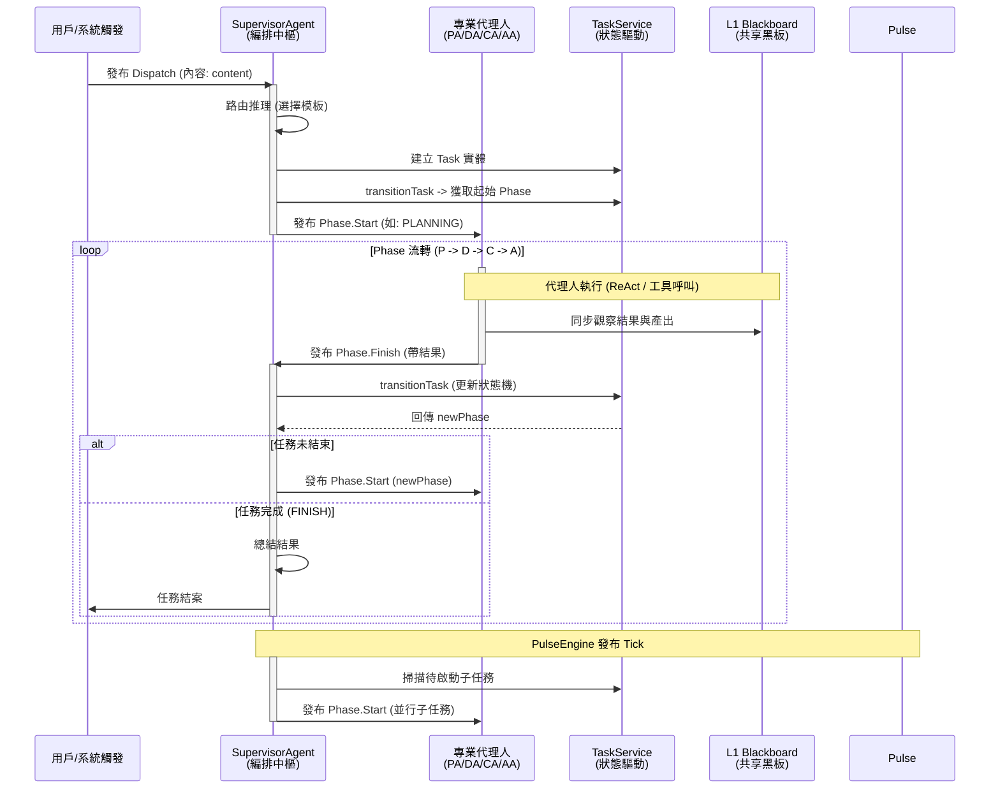

# SuperNova 系統架構 (System Architecture) - v0.6.0

## 1. 系統概述
SuperNova 是一個基於事件驅動與 PDCA 循環的代理蜂群系統。它採用分層架構，通過 **SupervisorAgent (SA)** 作為集中式編排中樞，管理任務生命週期、階段流轉與併發調度。

本系統的核心理念是將「認知」與「執行」解耦，透過標準化的通訊協議與雙層總帳機制，實現高品質的自主任務處理。

> **開發指引**：關於各個層級具體 Class 的職責定義與快速上手實作，請參閱 [QUICK_START.md](./QUICK_START.md)。

## 2. 核心分層與詳細定義

### 2.1 Agent 層 (編排與執行)
定義代理基類與 PDCA 專業角色。
- **核心角色**: 
    - **Supervisor (中樞)**: 系統大腦與編排器。負責路由決策、任務初始化、階段轉場 (Transition) 與子任務調度 (Tick)。
    - **Planning (規劃)**: 邏輯拆解專家。將高階目標拆解為結構化的任務圖 (subGraph)。
    - **Doing (執行)**: 自律行動者。利用 LangChain v1.0 (ReAct) 執行具體任務並同步結果至黑板。
    - **Checking (審核)**: 質量門禁。具備自主實證能力（ReAct 驗證），確保產出符合預期。
    - **Acting (改善)**: 系統進化師。進行知識甄別，將經驗沉澱為長效資產 (L2/L3)。

### 2.2 應用層 (協調服務)
提供業務邏輯服務，協調各項領域資源。
- **記憶服務 (MemoryService)**: 管理 L1 (黑板) / L2 (事實) / L3 (SOP) 的讀寫與升遷。
- **任務服務 (TaskService)**: 負責任務狀態機的驅動、持久化與任務圖管理。
- **會話服務 (SessionService)**: 管理用戶會話與上下文隔離。

### 2.3 領域層 (核心實體)
定義系統的核心實體，確保業務邏輯的純粹性。包含任務 (Task)、任務流 (Flow) 與記憶體 (Memory) 的模型。

### 2.4 基礎設施層 (支撐能力)
- **推理引擎 (InferenceEngine)**: 執行結構化 LLM 推理。
- **持久化層**: 基於抽象接口的數據儲存。
- **監控脈搏 (PulseEngine)**: 提供系統心跳，驅動 SA 的併發調度 Hook。

### 2.5 核心層 (系統基座)
提供依賴注入 (DI) 容器、生命週期管理與具備 **通配符支援** 的非同步事件總線 (EventBus)。

---

## 3. 核心運作機制

### 3.1 集中化事件編排 (Centralized Orchestration)
在 v0.6.0 中，SuperNova 廢除了原本分散的 `TaskScheduler` 邏輯，將所有決策權收斂至 **SupervisorAgent (SA)**：
- **階段流轉**: SA 監聽通用的 `Phase.Finish` 事件，呼叫 `TaskService` 推動狀態機，並根據新狀態發布 `Phase.Start`。
- **併發調度 (Tick)**：SA 監聽 `System.Tick` 事件，自動掃描並啟動準備就緒的子任務，實現非阻塞的分行執行。
- **自癒決策**：當偵測到 `Phase.Fail` 或 `Flow.Escalate` 時，由 SA 的換檔專家引擎 (Gear Shifter) 決定回退、重試或切換模板。

### 3.2 雙層總帳機制 (Two-Tier Ledger)
為了解決 Token 污染與目標偏移 (Goal Drift)，系統實作了嚴格的層級隔離：
- **一級總帳 (Communication State - `UserSession`)**：紀錄用戶高階需求與最終摘要。保持精煉，避免執行噪音干擾決策。
- **二級總帳 (Execution State - `Task`)**：紀錄 Agent 執行的技術細節（ReAct 思考、工具原始輸出）。這部分數據僅用於稽核與知識提煉，不向上污染。

### 3.3 標準化通訊協議 (Standardized Protocol)
- **通用 Payload (`IAgentEventPayload`)**：統一使用 `content` 欄位承載核心內容，移除 `goal` 等冗餘欄位。
- **通配符監控**：`EventBus` 支援 `*` 訂閱，允許全局監控腳本在不侵入 Agent 邏輯的情況下觀察整個系統的脈動。
- **Strict Mode 相容**：所有工具 Schema 符合 OpenAI 嚴格驗證規範，確保結構化輸出的高成功率。
- **模組化 Schema (Modular Schemas)**：Agent 的輸出結構依據角色拆分為 `PlanningSchemas`, `ActingSchemas`, `CheckingSchemas`, `SupervisingSchemas` 等獨立模組，確保職責單一化。

### 3.4 自主審核機制 (Autonomous Verification)
`CheckingAgent` 不再僅僅是文本對比器，而升級為具備「實證能力」的 Agent：
1. **ReAct 驗證**：先啟動一個工具驅動的循環，主動檢查黑板數據與文件系統。
2. **結構化收斂**：將驗證發現進行二次推理，壓縮為標準的 `CheckSchema` (PASS/FAIL/ESCALATE)。

---

## 4. PDCA 閉環協作流轉圖

## 5. 記憶體與持久化

### 5.1 三層記憶體架構 (Memory Matrix)
- **L1 Blackboard (黑板)**: 存放即時變數、跨階段交接指針與執行產出。
- **L2 Fact (事實)**: 存放經過 `ActingAgent` 甄別後的、具備長效價值的跨會話經驗。
- **L3 SOP (操作手冊)**: 存放標準化作業程序，指引未來的規劃與執行。

### 5.2 儲存原則
- **會話隔離**: 每個會話擁有獨立的即時狀態。
- **局部優先**: 檢索時優先考慮當前會話背景，再擴散至全域事實。
