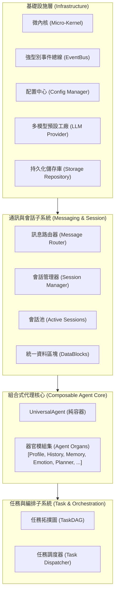
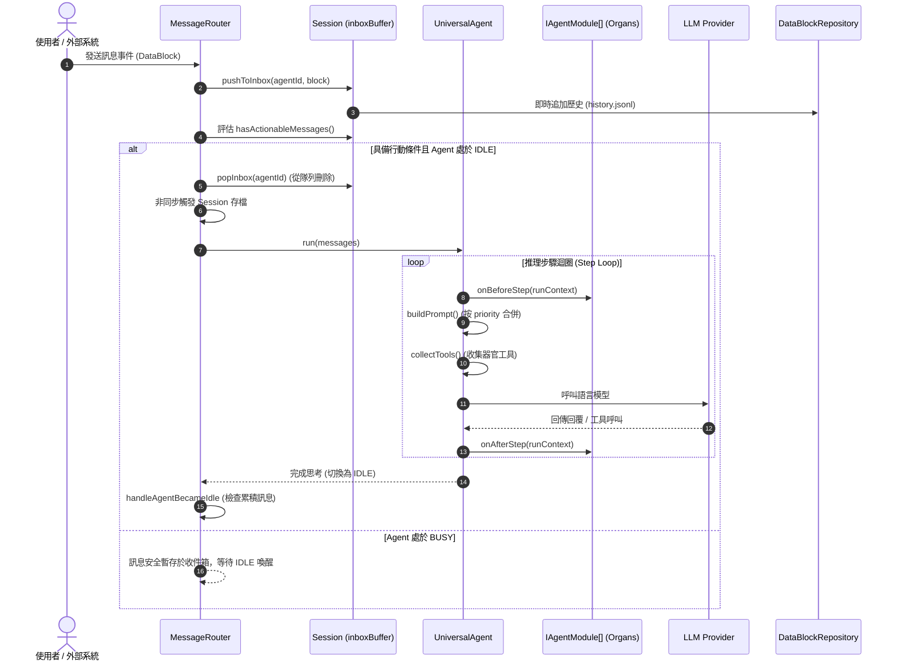

# SuperNova 全局系統架構總覽 (ARCH.md)

本文件定義 SuperNova 專案的全局系統拓撲、核心設計原則、各子系統職責邊界與運行時生命週期。

---

## 1. 系統架構願景與核心原則

SuperNova 是一套模組化、高擴展性且具備長期認知演進能力的自主多代理人 (Autonomous Multi-Agent) 協同作業系統。

### 核心設計原則 (Core Principles)
1. **認知先行 (Architecture First)**：全域架構契約先行於具體實作，嚴格定義資料流向與介面抽象。
2. **事件驅動 (Event-Driven)**：跨組件與異步通訊依賴 `EventBus`，避免阻塞調用破壞非同步生命週期。
3. **器官化組合 (Everything is an Organ)**：代理人為輕量骨架容器 (`UniversalAgent`)，所有業務邏輯、記憶、情緒與規劃能力均封裝為可插拔器官模組 (`IAgentModule`)。
4. **嚴格型別 (Strict Typing)**：所有通訊資料、設定規格全面採用 Zod Schema 與 TypeScript 嚴格驗證，禁止寬鬆的動態推斷。
5. **分層持久化 (Tiered Persistence)**：會話元數據、歷史軌跡與大型負載實施分離存儲，確保高並發傳輸效能與重啟自愈能力。

---

## 2. 系統分層架構 (System Layering)

系統由底至頂劃分為五大核心層級：

### 2.1 基礎設施層 (Infrastructure Layer)
- **微內核 (`@supernova/runtime`)**：提供統一生命週期狀態機（`INITIALIZING` → `BOOTING` → `RUNNING` → `STOPPING` → `STOPPED`）、外掛安裝機制（`IKernelPlugin`）與服務容器池。
- **事件總線 (`@supernova/events`)**：支援泛型型別安全的發佈/訂閱總線，具備系統生命週期、會話、代理與步驟多維度 Hook 事件支援。
- **配置中心 (`@supernova/common/config`)**：基於 YAML 與環境變數之不可變配置聚合器，採用 Zod 進行嚴格型別斷言。
- **LLM 提供者 (`@supernova/common/llm`)**：多模型預設 (Presets) 管理中心，封裝模型實例快取、動態推論參數與 LangChain 模型介面。
- **儲存設施 (`@supernova/storage`)**：提供檔案原子寫入、BaseJsonRepository 抽象、防路徑穿越安全保護，以及結合 Vectra 本地向量索引庫之知識圖譜倉儲 (`JsonGraphRepository`)。

### 2.2 通訊與會話子系統 (Messaging & Session Subsystem)
- **DataBlock**：全域統一的訊息載體，封裝控制負載、大資料參考、路由元數據與優先級標記。
- **Session 實體**：維護會話狀態（`ACTIVE`、`PAUSED`、`CLOSED`）、參與代理名單與專屬收件箱隊列 (`inboxBuffer`)。
- **SessionManager**：集中式會話池管理，具備閒置逾期自動清理與系統重啟時的會話恢復 (Session Recovery) 機制。
- **MessageRouter**：事件驅動之訊息分發核心，根據代理忙碌狀態 (`BUSY` / `IDLE`) 進行智慧排隊、行動喚醒判斷與消費後自動狀態同步。

### 2.3 代理人核心層 (Agent Core Layer)
- **UniversalAgent**：極簡容器（小於 400 行代碼），僅負責模組裝配、依賴檢驗、提示詞組裝與標準思考循環。
- **模組體系 (`IAgentModule`)**：定義器官的生命週期（`onAttach`、`onDetach`）、步驟前後鉤子（`onBeforeStep`、`onAfterStep`）、提示詞貢獻（`getPromptSections`）與工具提供（`getTools`）。
- **組裝引擎**：依據模組優先級 (`priority`) 動態組裝提示詞分段索引 (`PromptSectionIndex`) 與工具集合。

### 2.4 任務編排層 (Task Orchestration Layer)
- **TaskDAG**：有向無環圖任務拓撲，定義任務節點依賴、條件邊、執行超時與重試策略。
- **TaskDispatcher**：多代理協同調度引擎，負責將任務節點動態分配給適任的 Worker 代理並監控狀態回報。

---

## 3. 全局資料流與生命週期

### 3.1 訊息派發與代理思考時序

### 3.2 系統啟動與優雅停機流程

```mermaid
flowchart TD
    subgraph BootFlow["系統開機流程 (Kernel.boot)"]
        B1["初始化核心組件 (Kernel.initialize)"] --> B2["啟動儲存與配置中心"]
        B2 --> B3["啟動 EventBus 與 LLMProvider"]
        B3 --> B4["啟動 SessionManager\n(執行 Session Recovery 批次載入未完成會話)"]
        B4 --> B5["啟動 MessageRouter 與 Agent 實例池"]
        B5 --> B6["核心就緒 (RUNNING)"]
    end

    subgraph ShutdownFlow["優雅停機流程 (Kernel.stop)"]
        S1["接收停機訊號 (SIGINT / 呼叫 stop)"] --> S2["停止 MessageRouter (拒絕新訊息，等待進行中任務完成)"]
        S2 --> S3["凍結所有 ACTIVE 會話為 SUSPENDED 並存檔至磁碟"]
        S3 --> S4["停止 UniversalAgent 與卸載所有器官模組"]
        S4 --> S5["關閉 LLM 連線與儲存庫寫入緩衝"]
        S5 --> S6["核心完全終止 (STOPPED)"]
    end
```

---

## 4. 模組器官目錄導覽

| 模組類別 | 模組名稱 | 優先級 | 職責說明 | 文件連結 |
| :--- | :--- | :---: | :--- | :--- |
| **身分與協議** | `ProfileModule` | 5 | 角色定位、人設定義、通訊規範與動態調度 LLM Preset | [查看文件](./architecture/modules/profile_module.md) |
| **會話歷史** | `HistoryModule` | 10 | 歷史載入、滑動窗口壓縮、上下文格式化與兩段式大資料卸載 | [查看文件](./architecture/modules/history_module.md) |
| **長期記憶** | `MemoryModule` | 20 | 語意圖譜記憶 (Graph Memory)、每日情節總結與關聯檢索 | [查看文件](./architecture/modules/memory_module.md) |
| **情緒認知** | `EmotionModule` | 30 | OCC 心理模型狀態評估、情緒波動計算與心理特徵注入 | [查看文件](./architecture/modules/emotion_module.md) |
| **目標規劃** | `PlannerModule` | 40 | LATS 樹狀探索、任務目標遞迴分解與自我反思機制 | [查看文件](./architecture/modules/planner_module.md) |
| **協同監督** | `SupervisorModule` | 40 | 多代理權限動態審查、代理授權與任務仲裁 | [查看文件](./architecture/modules/supervisor_module.md) |
| **意識投影** | `ProjectionModule` | 50 | 跨代理能力動態投影、遠程器官借用與多重人格投射 | [查看文件](./architecture/modules/projection_module.md) |
| **任務執行** | `TaskWorkerModule`| 60 | TaskDAG 任務節點具體執行、工具呼叫與結果回傳 | [查看文件](./architecture/modules/task_worker_module.md) |
| **環境具身** | `EmbodimentModule`| 70 | 外部物理/數位環境感知、即時狀態同步與專用工具綁定 | [查看文件](./architecture/modules/embodiment_module.md) |

---

## 5. 相關架構子系統文件

- [系統架構哲學與設計模式 (Overview)](./architecture/overview.md)
- [微內核架構 (Micro-Kernel)](./architecture/kernel/micro_kernel.md)
- [強型別事件總線 (EventBus)](./architecture/kernel/event_bus.md)
- [配置中心與型別系統 (Config System)](./architecture/kernel/config_system.md)
- [LLM 多模型預設工廠 (LLM Provider)](./architecture/kernel/llm_provider.md)
- [統一訊息載體與卸載 (DataBlock)](./architecture/messaging/datablock.md)
- [會話實體與狀態機 (Session)](./architecture/messaging/session.md)
- [會話生命週期管理 (Session Manager)](./architecture/messaging/session_manager.md)
- [訊息路由器與排隊機制 (Message Router)](./architecture/messaging/message_router.md)
- [組合式代理容器 (Universal Agent)](./architecture/agent/universal_agent.md)
- [器官介面規範 (Module Interface)](./architecture/agent/module_interface.md)
- [動態提示詞組裝引擎 (Prompt Engine)](./architecture/agent/prompt_engine.md)
- [有向無環任務圖 (TaskDAG)](./architecture/task/task_dag.md)
- [任務調度器 (Task Dispatcher)](./architecture/task/task_dispatcher.md)
- [儲存庫模式規範 (Repository Pattern)](./architecture/storage/repository_pattern.md)
- [檔案系統持久化架構 (File System Storage)](./architecture/storage/file_system_storage.md)
- [全局事件規格清單 (Event Catalogue)](./api/event_catalogue.md)
- [模組開發契約指南 (Module Contract)](./api/module_contract.md)
