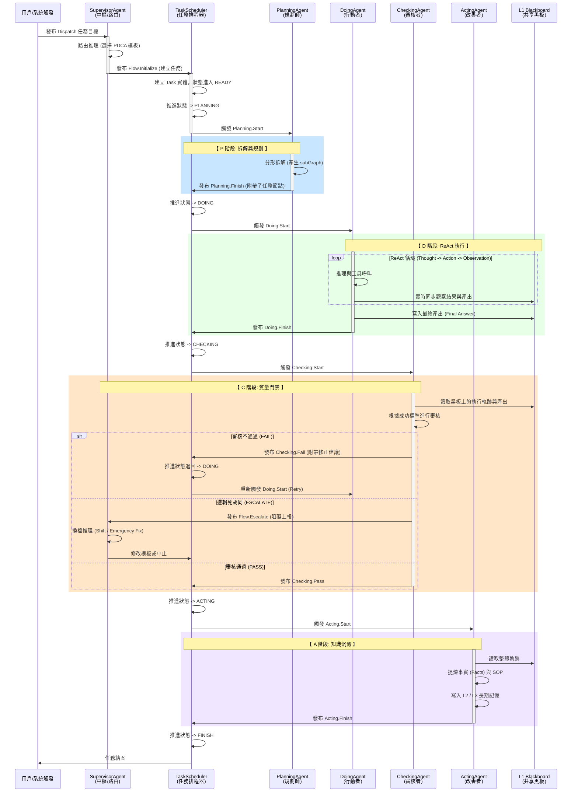

# SuperNova 系統架構 (System Architecture)

## 1. 系統概述
SuperNova 是一個基於事件驅動與 PDCA 循環的代理蜂群系統。它採用分層架構，通過全局運行時 (Global Runtime) 管理組件生命週期，並利用 AI 推理引擎實現自主規劃與任務自癒。

本系統的核心理念是將「認知」與「執行」解耦，透過標準化的通訊協議讓多個專業代理人協同完成複雜任務。

> **開發指引**：關於各個層級具體 Class 的職責定義與快速上手實作，請參閱 [QUICK_START.md](./QUICK_START.md)。

## 2. 核心分層與詳細定義

### 2.1 Agent 層
定義代理基類與 PDCA 專業角色。
- **核心角色**: 
    - **Supervisor**: 系統中樞，負責路由與分發。
    - **Planning**: 邏輯拆解，產出任務圖譜。
    - **Doing**: 具體執行，具備 ReAct 推理能力。
    - **Checking**: 質量門禁，執行結果審核。
    - **Acting**: 持續改進，經驗標準化。

### 2.2 應用層
提供業務邏輯服務，協調各項領域資源。
- **記憶服務**: 管理 L1/L2/L3 記憶的生命週期。
- **任務服務**: 處理任務的持久化與狀態追蹤。
- **會話服務**: 管理用戶會話與上下文隔離。

### 2.3 領域層
定義系統的核心實體，確保業務邏輯的純粹性。包含任務 (Task)、記憶 (Memory) 與用戶 (User) 的模型定義。

### 2.4 基礎設施層
提供系統支撐能力。
- **推理引擎**: 執行 LLM 推理與結構化輸出解析。
- **持久化層**: 基於抽象接口的數據儲存，支持多種後端。
- **監控脈搏**: 負責系統的心跳偵測與定期自癒任務。

### 2.5 核心層
系統的基座，提供依賴注入 (DI) 容器、生命週期管理與非同步事件總線。

---

## 3. 核心運作機制

### 3.1 代理生命週期與上下文隔離 (Agent Lifecycle & Context Isolation)
為了確保系統的高可靠性與可擴展性，SuperNova 的代理架構遵循以下設計原則：
- **無狀態單例 (Stateless Singletons)**：所有的 Agent (SA, PA, DA, CA, AA) 都是運行在 GlobalRuntime 中的單一實例。它們身上不綁定任何使用者的狀態或對話歷史。這使得同一個 Agent 能夠並行處理來自不同任務的事件。
- **會話歷史獨立 (Independent Session History)**：每個 Task (本質上是一個二級 Session) 擁有獨立的對話歷史 (`history` 陣列)。這份歷史**不會**跨越 PDCA 階段共享。
- **清晰的交接 (Explicit Handoff)**：不同階段的 Agent 之間不看對方的內部思考過程。例如，`CheckingAgent` 不會去讀取 `DoingAgent` 嘗試錯誤的 ReAct 對話紀錄；它只透過 L1 Blackboard 上儲存的最終產出與事件 Payload 中攜帶的交接訊息來進行工作。這極大地節省了 Token 消耗並避免了注意力分散 (Attention Dilution)。

### 3.2 雙層總帳機制 (Two-Tier Ledger)
為了解決傳統 Agent 系統中「對話上下文 (Context) 同時承載人機溝通與工具執行細節」所導致的 Token 污染與邏輯偏移 (Goal Drift)，SuperNova 實作了嚴格實作了嚴格的雙層隔離：
- **一級總帳 (Communication State - `UserSession`)**：
  這是 SupervisorAgent (SA) 與用戶對話的「客廳」。這裡只紀錄「用戶的高階要求」與「系統的最終結果摘要」。它保持了極度的精煉，確保 SA 在進行目標路由與決策時不會被底層執行的噪音干擾。
- **二級總帳 (Execution State - `Task`)**：
  這是專業 Agent (PA, DA, CA) 執行的「工廠」。每個子任務都有自己的二級總帳，裡面紀錄了冗長的 ReAct 思考循環、工具調用的原始輸入輸出、以及除錯報錯訊息。這些 `history` 是作為「稽核軌跡 (Audit Trail)」、「提煉 SOP 的礦石」以及「崩潰除錯的線索」，**絕對不會**向上污染到一級總帳中。

### 3.3 鏈路追蹤與可觀察性 (Traceability & Observability)
為了確保複雜任務鏈的可追蹤性，系統導入了嚴密的鏈路 ID 體系：
- **根任務錨定 (Root-Task Anchoring)**：`traceId` 不再隨機生成，而是錨定於初始任務的 `taskId`。這使得開發者能透過一個 ID 串聯起整個任務樹的所有日誌與狀態。
- **DNA 嚴格繼承**：透過 `BaseAgent.inheritPayload` 與 `TaskScheduler` 的中轉，確保所有衍生事件 (Event) 與子任務 (Sub-task) 無條件繼承 `traceId`。
- **樹狀 Span 鏈鏈鏈鏈鏈接**：利用 `spanId` 與 `parentSpanId` 標識執行片段的父子關係，完整還原 PDCA 循環的動態呼叫圖。

### 3.4 模組化推理編排 (Modular Reasoning Orchestration)
系統不依賴單一大型系統提示詞。中樞代理擔任編排器角色，針對特定決策場景動態調用專業推理模組：
- **路由專家**：判定任務模板。
- **換檔專家**：處理異常上報與動態路徑修正。

### 3.4 事件驅動架構 (Event-Driven Architecture)
相較於傳統的 Pipeline 模式 (`plan().then(do).then(check)`)，SuperNova 堅持採用基於 Event Bus 與 TaskScheduler 的事件驅動架構。其核心考量為：
- **強大的彈性與自癒能力**：當偵測到問題 (`CHECKING_FAIL` 或 `FLOW_ESCALATE`)，系統不需要依賴複雜的巢狀 `try-catch` 或 `while` 迴圈來回退狀態。TaskScheduler 可以輕鬆地將狀態機退回前一個階段，重新發布 `Start` 事件即可實現重試或換檔。
- **狀態可持久化與非同步恢復 (Suspend & Resume)**：任務可以在任何階段被中斷（例如等待外部 API 或系統重啟）。只要 Task 的狀態持久化在資料庫中，下次開機便可發出對應的事件無縫接軌。
- **異步與並行處理**：方便處理由 PlanningAgent 拆解出的大量並行子任務，互不阻塞。

### 3.5 PDCA 閉環協作
系統透過事件驅動模式推動任務流轉，每個階段皆由專業代理負責並產出驗證標準。

#### 代理協作任務流轉圖

#### 流程亮點說明：
1. **中樞路由 (SA)**：起始任務不直接進入死板的流程，而是由 SupervisorAgent 先決定適合的 PDCA 複雜度模板（例如：Simple 還是 Standard）。
2. **規劃分形 (PA)**：PlanningAgent 會將複雜目標拆解成具體的子任務清單（`subGraph`），這為「任務即會話」的分形架構打好基礎。
3. **黑板同步 (L1)**：DoingAgent 在 ReAct 循環中會把結果持續寫入 L1 黑板，這確保了隨後的 CheckingAgent 能夠取得實體驗證數據，避免幻覺。
4. **換檔退回 (Escalation & Retry)**：在 CheckingAgent 階段，任務不只會 Pass。如果實作瑕疵，會退回 DoingAgent；如果遇到邏輯阻礙（底層 API 根本不支援等），則觸發 `ESCALATE` 讓 SupervisorAgent 進行高層次換檔。
5. **知識沉澱 (AA)**：流程成功後，ActingAgent 負責總結經驗並將其升遷至長期記憶（L2/L3），使整個系統具備演化能力。

### 3.3 三層記憶體架構 (Memory Matrix)
系統採用分層記憶體以平衡效能與長效知識儲存。
- **L1 Blackboard (黑板)**: 存放即時變數。
- **L2 Fact (事實)**: 存放已驗證的長期事實。
- **L3 SOP (操作手冊)**: 存放標準化作業程序。

### 3.4 持久化與儲存結構
系統採用「會話中心化」的邏輯結構，確保數據隔離與跨會話知識複用。
- **數據隔離**: 每個會話擁有獨立的即時狀態與任務軌跡。
- **知識沉澱**: 全域事實庫支持跨任務的共用。
- **檢索原則**: 遵循「局部優先」策略。