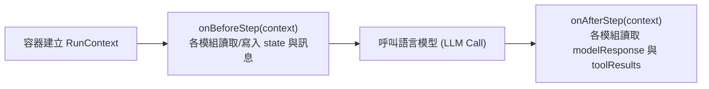

# 代理器官介面與生命週期規格 (Module Interface)

所有賦予代理人具體能力的器官（身分、歷史、記憶、情緒、規劃、任務等）皆必須實作 `IAgentModule` 介面 (`src/core/agent/types.ts`)。本文件詳細規範模組介面契約、上下文存取權限與步驟上下文流轉機制。

---

## 1. 核心介面定義 (`IAgentModule`)

```typescript
export interface IAgentModule {
    /** 模組唯一名稱識別碼 (如 "profile", "history", "memory") */
    readonly name: string;

    /** 
     * 執行優先級 (數值越小越早執行)
     * 決定 BeforeStep / AfterStep 調用順序以及 PromptSection 的堆疊順序
     */
    readonly priority: number;

    /** 依賴宣告：掛載此模組前必須已存在之模組名稱清單 */
    readonly requires: string[];

    /** 衝突宣告：禁止與此模組共存之模組名稱清單 */
    readonly conflicts: string[];

    // ─── 生命週期鉤子 ───

    /** 當模組被掛載至代理人容器時調用，注入代理人核心上下文 */
    onAttach(agent: IAgentContext): void | Promise<void>;

    /** 當模組被自代理人容器卸載時調用，負責釋放資源與監聽器 */
    onDetach(): void | Promise<void>;

    // ─── 步驟推理鉤子 (可選) ───

    /** 單一步驟推理呼叫模型前觸發，可用於注入上下文或動態前置檢查 */
    onBeforeStep?(context: RunContext): void | Promise<void>;

    /** 單一步驟推理呼叫模型後觸發，可用於記憶萃取、情緒計算或狀態更新 */
    onAfterStep?(context: RunContext): void | Promise<void>;

    // ─── 認知與工具貢獻 (可選) ───

    /** 提供此模組欲注入至提示詞系統的區塊段落清單 */
    getPromptSections?(): PromptSection[];

    /** 提供此模組供 LLM 呼叫的工具清單 */
    getTools?(): BaseTool[];

    // ─── 狀態持久化 (可選) ───

    /** 序列化內部器官狀態供磁碟存檔 */
    serialize?(): any;

    /** 從持久化資料還原內部器官狀態 */
    hydrate?(state: any): void;
}
```

---

## 2. 代理人上下文介面 (`IAgentContext`)

當模組透過 `onAttach` 接入時，容器提供受控的代理人能力視圖，杜絕模組私自獲取全局非受控物件：

```typescript
export interface IAgentContext {
    /** 代理人唯一識別碼 */
    readonly agentId: string;
    /** 當前運行的會話識別碼 */
    readonly sessionId: string;
    /** 當前使用的模型預設名稱 */
    readonly presetName: string;
    /** 全域事件總線實例 */
    readonly eventBus: IEventBus;

    /** 動態切換代理人使用的模型預設 (如由 profile 或 planner 發起) */
    setPresetName(presetName: string): void;

    /** 查詢容器中是否存在特定器官模組 */
    hasModule(name: string): boolean;

    /** 獲取容器中特定器官模組的公開介面 (安全存取) */
    getModule<T extends IAgentModule>(name: string): T | undefined;
}
```

---

## 3. 步驟推理上下文 (`RunContext`)

在單一步驟推理生命週期中，`RunContext` 作為跨器官的瞬時資料匯流排傳遞：



```typescript
export interface RunContext {
    /** 當前推理輪次索引 (0 ~ max_turns - 1) */
    readonly stepIndex: number;
    /** 當前送入模型的全量 LangChain 訊息序列 */
    messages: BaseMessage[];
    /** 供各模組在單一步驟中共享臨時變數之鍵值字典 */
    state: Record<string, any>;
    /** 當前步驟已收集到的工具清單 */
    tools: BaseTool[];
    /** 模型產生的回覆物件 (於 onAfterStep 階段就緒) */
    modelResponse?: AIMessage;
    /** 工具執行產生的結果清單 (於 onAfterStep 階段就緒) */
    toolResults?: any[];
}
```

---

## 4. 模組通訊與協同準則

1. **嚴禁模組間直接引用 (No Direct Imports)**：
   - 模組程式碼嚴禁 `import { EmotionModule } from '...'` 來呼叫具體實體。
2. **通訊模式雙軌制**：
   - **非同步事件流**：跨模組長期狀態通知一律透過 `context.eventBus.publish()`。
   - **同步推理鏈路**：單一步驟內的緊密協同透過 `RunContext.state` 進行安全的鍵值共享。
