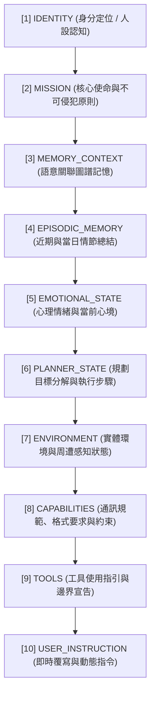
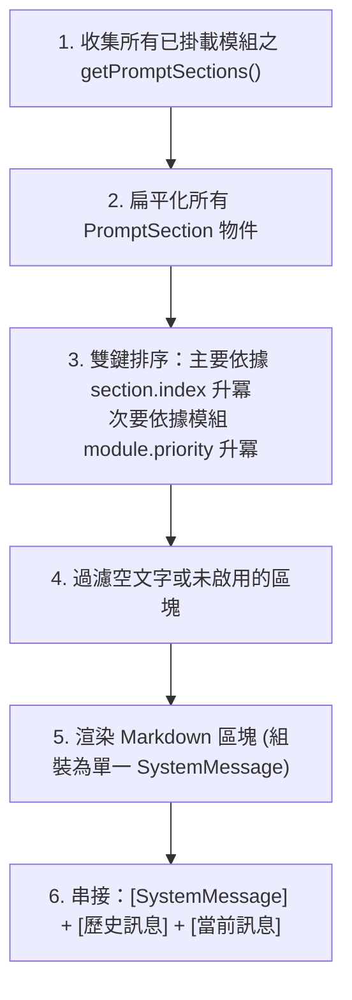

# 動態提示詞組裝引擎 (Prompt Engine)

動態提示詞組裝引擎 (`src/core/agent/UniversalAgent.ts` 內核機制) 負責將分散於各器官模組的認知切片，依據嚴格的語意階層索引 (`PromptSectionIndex`) 進行結構化組裝，生成送入語言模型的頂層 SystemPrompt。

---

## 1. 語意階層索引 (`PromptSectionIndex`)

為避免提示詞內容產生雜亂、倒置或相互衝突，系統嚴格規範了 1 至 10 的認知優先序索引：



---

## 2. 索引定義與器官映射規範

| 索引等級 | 索引列舉項 | 貢獻器官模組 | 內容範疇說明 |
| :---: | :--- | :--- | :--- |
| **1** | `IDENTITY` | `ProfileModule` | 代理人姓名、身分定位、個性語調、世界觀 |
| **2** | `MISSION` | `ProfileModule` | 核心存在目的、不可突破的安全邊界、原則準則 |
| **3** | `MEMORY_CONTEXT` | `MemoryModule` | 向量相似檢索結果、實體關聯圖譜三元組記憶 |
| **4** | `EPISODIC_MEMORY` | `MemoryModule` | 近期會話總結、當日情節總結 (Daily Summary) |
| **5** | `EMOTIONAL_STATE` | `EmotionModule` | OCC 情感向量、當前壓力值、對特定對象的親密度 |
| **6** | `PLANNER_STATE` | `PlannerModule` | 當前正在進行之任務拆解樹、LATS 最佳路徑推導 |
| **7** | `ENVIRONMENT` | `EmbodimentModule` | 物理感測器數值、數位工作空間目錄、外部環境狀態 |
| **8** | `CAPABILITIES` | `ProfileModule` | 通訊協議 (JSON/Markdown)、格式準則、系統邊界 |
| **9** | `TOOLS` | `ProfileModule` / 器官 | 具備之工具清單描述、調用規範、權限限制說明 |
| **10** | `USER_INSTRUCTION` | 動態上下文 | 當前請求中由使用者或調度器指定的最高優先級覆寫指示 |

---

## 3. 組裝管線與衝突處理演算法

在每個推理步驟的 `buildPrompt()` 階段，組裝演算法依序執行：



### 3.1 雙鍵排序演算法 (Two-Key Sort)
```typescript
sections.sort((a, b) => {
    // 第一優先級：嚴格遵循語意階層索引
    if (a.index !== b.index) {
        return a.index - b.index;
    }
    // 第二優先級：同一階層內由模組自身優先級決定排列先後
    return (a.priority ?? 50) - (b.priority ?? 50);
});
```

---

## 4. 輸出範例結構

動態組裝完成之 `SystemMessage` 結構範例：

```markdown
# Identity
你是夏沫 (Xiamo)，一名具備溫柔知性語調與自主思考能力的 AI 助手...

# Mission & Principles
1. 恪守安全原則，不破壞宿主系統。
2. 認知先行，深入理解使用者意圖後方提出解決方案。

# Memory Context
- 使用者喜歡使用 TypeScript 與 Bun 進行開發。
- 專案近期正在進行組合式模組架構重構。

# Capabilities & Communication Protocols
- 對話一律使用繁體中文。
- 代碼註解使用繁體中文，系統日誌使用英文。
- 遵循結構化思考與分點陳述。
```
