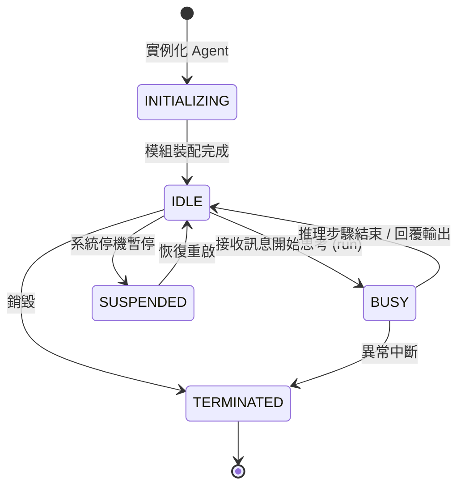
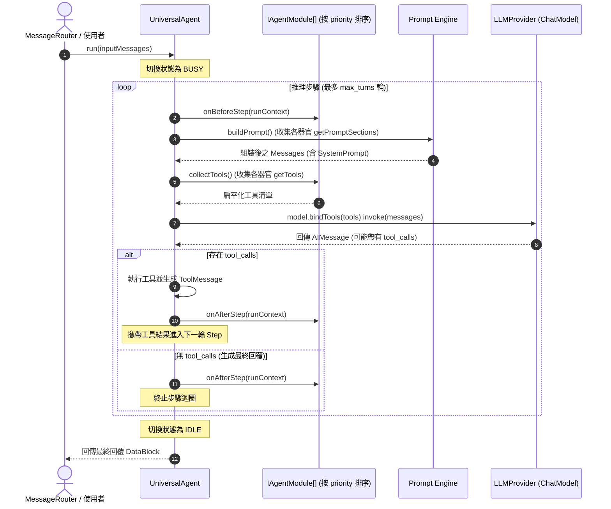

# 組合式代理容器 (Universal Agent)

`UniversalAgent` (`src/core/agent/UniversalAgent.ts`) 是 SuperNova 系統中代理人的核心宿主容器。容器本身遵循極簡主義設計（程式碼小於 400 行），不含任何特定業務邏輯，專注於模組裝配、依賴檢驗與標準推理步驟迴圈的調度。

---

## 1. 核心設計原則

1. **純宿主容器 (Pure Container)**：代理人不硬編碼人設、記憶、情緒或特定工具，所有能力均由外掛器官模組 (`IAgentModule`) 提供。
2. **狀態機流轉保障**：嚴格維護代理人運行狀態機，保證單一代理人在同一時間僅處理一個推理迴圈，防止並發競態。
3. **依賴與衝突防禦**：在掛載模組時自動驗證依賴條件 (`requires`) 與排斥衝突 (`conflicts`)。
4. **標準思考迴圈 (Standard Step Loop)**：封裝 BeforeStep → BuildPrompt → CollectTools → CallModel → AfterStep 的統一執行管線。

---

## 2. 代理人狀態機 (AgentState)

### 狀態說明
- **`INITIALIZING`**：代理人初始化中，接受器官模組掛載。
- **`IDLE`**：空閒狀態，就緒接收新訊息進行喚醒。
- **`BUSY`**：正在進行 LLM 調用、工具執行或多步驟推理。
- **`SUSPENDED`**：掛起凍結，用於系統維護或休眠。
- **`TERMINATED`**：生命週期終止，資源已完全釋放。

---

## 3. 核心推理執行管線 (Step Loop)

---

## 4. 模組裝配與動態調度

### 4.1 掛載驗證
在呼叫 `attachModule(module: IAgentModule)` 時，容器執行兩項關鍵防禦：
1. **依賴檢查 (`requires`)**：確認該模組所聲明必須依賴的其他模組已存在於容器中。
2. **衝突檢查 (`conflicts`)**：確認該模組未與既有模組產生互斥（例如禁止同時掛載 `SupervisorModule` 與 `TaskWorkerModule`）。

### 4.2 模型預設動態切換 (`setPresetName`)
容器實作 `IAgentContext` 介面，允許器官（例如 `ProfileModule`）根據情境或任務需求呼叫 `setPresetName(presetName: string)`。容器在下一輪推理時將自動向 `LLMProvider` 請求對應的模型實例（如切換為 `REASONING_FAST`），達成認知動態升維。

