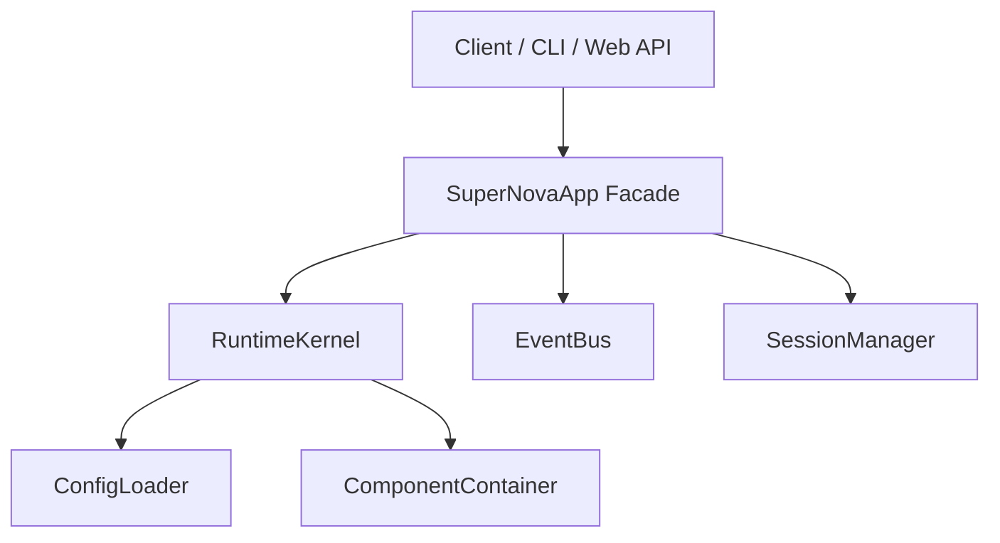

# Application Layer (應用層與外觀模式)

本文件描述 SuperNova 系統中應用層（Application Layer）的設計與職責，主要由 `SuperNovaApp` 類別實現。

## 1. 核心職責 (Core Responsibilities)

在基底設施建立完善後，直接讓外部介面（如 CLI、Web UI、Bot）呼叫 `RuntimeKernel`、`EventBus` 或 `SessionManager` 會導致極高的耦合與重複代碼。因此，引入 `SuperNovaApp` 作為 **外觀模式 (Facade)**：

*   **生命週期管理 (Lifecycle Management)**：封裝 `RuntimeKernel` 的初始化與停止，並負責處理配置檔 (Config) 的加載。
*   **優雅關閉 (Graceful Shutdown)**：在應用層級捕捉 OS 訊號（如 `SIGINT`, `SIGTERM`），確保系統安全關閉並存檔。
*   **介面解耦 (Interface Decoupling)**：對外提供簡單直觀的 API（如 `sendMessage`, `onMessage`, `onAgentIdle`），隱藏底層複雜的 `DataBlock` 建立與 EventBus 訂閱細節。
*   **會話協調 (Session Coordination)**：封裝 `SessionManager` 的操作，自動處理會話的載入或創建。

## 2. API 設計與事件

`SuperNovaApp` 提供以下主要介面供客戶端使用：

### 生命週期
*   `start(configPath?: string): Promise<void>`：啟動內核與基礎設施。
*   `stop(): Promise<void>`：安全關閉系統，觸發所有的 `stop` lifecycle hook。

### 訊息與互動
*   `initializeSession(sessionId: string, mainAgentId: string): Promise<void>`：確保指定的會話存在，並綁定主代理人。
*   `sendMessage(sessionId: string, text: string, targetId: string, senderName?: string): void`：封裝使用者訊息為 `DataBlock` 並透過 `EventBus` 發布。
*   `triggerSessionOptimization(sessionId: string): void`：手動觸發換日優化。

### 事件訂閱 (Event Subscriptions)
應用程式層將底層複雜的 EventBus 事件抽象為簡單的 callback 註冊：
*   `onMessage(callback: (msg: DataBlock) => void)`：當系統有對外回覆時觸發。
*   `onSystemReady(callback: () => void)`：當系統就緒時觸發。
*   `onAgentIdle(callback: (agentId: string) => void)`：當指定代理人處理完畢、狀態轉為閒置時觸發（解決舊有 UI 需要 setTimeout 的問題）。

## 3. 整合架構圖

## 4. 設計規範
*   `SuperNovaApp` **不可** 包含任何特定的介面邏輯（如 readline、HTTP 路由）。
*   客戶端只能透過 `SuperNovaApp` 互動，不應直接存取 `RuntimeKernel`。
