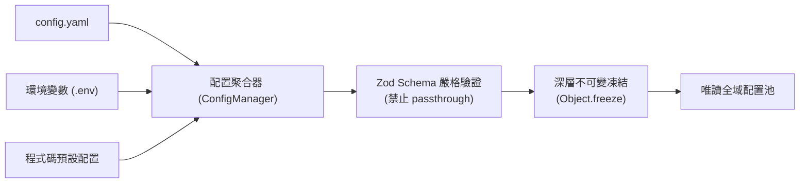

# 配置中心與嚴格型別校驗 (Config System)

配置中心 (`@supernova/common/config`) 是 SuperNova 系統靜態規格與環境參數的唯讀管理基礎設施，負責多來源配置聚合、Zod 嚴格型別驗證與不可變凍結保護。

---

## 1. 核心設計原則

1. **嚴格型別 (Strict Typing)**：全面禁止使用寬鬆的非結構化參數或 `.passthrough()`，所有配置項（含模型特定擴展參數）必須擁有明確的 Zod Schema 定義。
2. **多來源聚合順序**：
   ```
   內建程式碼預設值 (Defaults) 
         ↓ (覆寫)
   本地 YAML 設定檔 (config.yaml) 
         ↓ (覆寫)
   環境變數 (Environment Variables / .env)
   ```
3. **不可變凍結 (Immutability)**：配置經載入與驗證成功後，全物件執行深層遞迴凍結 (`Object.freeze`)，防止運行期狀態遭非預期污染。
4. **模組化分區 (Section Registration)**：支援動態註冊配置分區（如 `llm`、`storage`、`agent` 等），實現外掛式配置擴展。

---

## 2. 核心架構與分區規格



### 2.1 核心配置分區結構

#### 1. 語言模型分區 (`llm`)
- `default_preset`: 預設模型預設名稱 (如 `DEFAULT`, `FAST`)。
- `presets`: 具名預設映射表，每一項目皆定義：
  - `modelName`: 模型字串 (如 `gpt-5.6-luna`, `gpt-4o-mini`)。
  - `temperature`: 採樣溫度 (0.0 ~ 2.0)。
  - `maxTokens`: 最大生成 token 數。
  - `reasoning`: 思考推理參數（`effort`: `'none' | 'low' | 'medium' | 'high'`, `summary`: `'auto' | 'detailed'`）。
  - `parallel_tool_calls`: 是否允許並行工具呼叫 (布林值)。
  - `service_tier`: 服務層級 (如 `'flex'`, `'default'`)。

#### 2. 代理人行為分區 (`agent`)
- `profile_version`: 人設設定版本 (如 `self`)。
- `max_turns`: 單次會話最大允許推理輪次。
- `force_wakeup_threshold`: 訊息積壓強制自主喚醒門檻。
- `enable_payload_offload`: 是否開啟大資料外部檔案卸載開關。
- `offload_threshold_new_message`: 新訊息即時落盤之大小門檻 (位元組)。
- `offload_threshold_compact`: 舊歷史滑動窗口壓縮之深度卸載門檻 (位元組)。

#### 3. 儲存基礎分區 (`storage`)
- `base_dir`: 本地資料根目錄 (如 `workspace`)。
- `session_dir`: 會話與歷史儲存子目錄 (如 `sessions`)。
- `memory_dir`: 長期記憶與向量庫子目錄 (如 `memory`)。

---

## 3. 嚴格模式宣告範例 (TypeScript + Zod)

```typescript
// 嚴格定義思考推理配置，嚴禁 passthrough
export const ReasoningSchema = z.object({
    effort: z.enum(['none', 'low', 'medium', 'high']).optional(),
    summary: z.enum(['auto', 'detailed']).optional(),
}).strict();

export const LLMPresetSchema = z.object({
    modelName: z.string().min(1),
    temperature: z.number().min(0).max(2).default(0.7),
    maxTokens: z.number().int().positive().default(4096),
    timeout: z.number().int().positive().optional(),
    maxRetries: z.number().int().nonnegative().optional(),
    reasoning: ReasoningSchema.optional(),
    parallel_tool_calls: z.boolean().optional(),
    service_tier: z.string().optional(),
}).strict();
```

---

## 4. 運行期存取模式

微內核啟動時自動實例化並凍結配置，其他模組透過依賴注入獲取唯讀配置視圖：

```typescript
// 安全存取已凍結的設定值
const storageConfig = configManager.getSection<StorageConfig>('storage');
console.log(storageConfig.base_dir); // "workspace"

// 企圖修改將於執行期拋出 TypeError (嚴格模式)
// storageConfig.base_dir = "tampered"; // Error: Cannot assign to read only property
```
