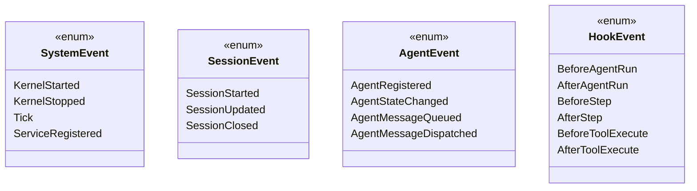

# 強型別事件總線 (EventBus)

事件總線 (`@supernova/events`) 是 SuperNova 系統內部唯一的跨模組通訊與生命週期監聽基礎設施，提供高吞吐量、非阻塞且具備 TypeScript 嚴格泛型推導的事件調度能力。

---

## 1. 核心設計原則

1. **零直接耦合**：跨子系統（如會話、代理、外部監聽器）不保留彼此的物件實例參考，全數藉由事件協調。
2. **強型別約束**：拒絕寬鬆字串傳遞，所有事件均對應明確的 `EventPayloadMap` 映射與結構定義。
3. **非阻塞廣播**：事件發佈 (`publish`) 為非同步排程（依賴事件循環排程），確保事件生產者立即解脫，不受複雜監聽器執行耗時影響。
4. **生命週期 Hook 鏈**：全面支援代理人執行期核心步驟前後的攔截與觀測（Before/After Step、Before/After Tool）。

---

## 2. 事件規格與資料結構

### 2.1 基礎事件介面 (`IEvent<T>`)
所有流通於總線的事件均包裝為標準封裝結構：

```typescript
export interface IEvent<T = any> {
    /** 事件唯一類型識別碼 (如 agent.state_changed) */
    readonly type: string;
    /** 事件產生之 Unix 毫秒時間戳 */
    readonly timestamp: number;
    /** 關聯會話 ID (若為會話內事件) */
    readonly sessionId?: string;
    /** 關聯代理人 ID (若為特定代理人事件) */
    readonly agentId?: string;
    /** 強型別自訂負載資料 */
    readonly payload: T;
}
```

### 2.2 事件分類體系



---

## 3. 泛型訂閱與型別安全

為了防止回呼函數中的事件物件退化為寬鬆的 `any`，事件總線提供精確的多載簽名：

```typescript
export interface IEventBus {
    /** 廣播強型別事件 */
    publish<T>(event: IEvent<T>): void;

    /** 訂閱特定型別事件，回傳解除訂閱函式 */
    subscribe<E extends IEvent<any>>(
        type: string,
        handler: (event: E) => void | Promise<void>
    ): () => void;

    /** 取消訂閱 */
    unsubscribe(type: string, handler: Function): void;

    /** 清空所有訂閱器 */
    clear(): void;
}
```

### 訂閱範例
```typescript
// 訂閱會話關閉事件，自動推導 event.payload 型別
const unsubscribe = eventBus.subscribe<IEvent<{ sessionId: string; reason?: string }>>(
    SessionEvent.SessionClosed,
    (event) => {
        console.log(`Session closed: ${event.payload.sessionId}`);
    }
);

// 當不再需要時直接呼叫釋放
unsubscribe();
```

---

## 4. 關鍵機制實作

### 4.1 廣播異常隔離
當特定訂閱者的回呼函式拋出異常時，事件總線內部會予以捕捉並記錄錯誤日誌，絕對不中斷同一事件隊列中其他訂閱者的正常執行，確保系統全局韌性。

### 4.2 內核整合與自動注入
當外掛（如 `SessionManager` 或 `MessageRouter`）安裝至 `Kernel` 時，微內核會自動將具名為 `'events'` 的 `IEventBus` 實例注入至外掛內部，達成自動裝配。
