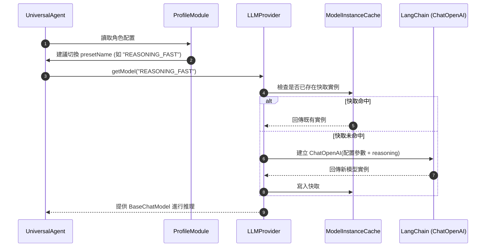

# LLM 多模型預設工廠 (LLM Provider)

LLM 提供者 (`@supernova/common/llm`) 是 SuperNova 系統存取底層大語言模型與嵌入模型的統一中樞，具備多預設配置管理 (Presets)、實例快取複用、客製化模型工廠擴展與優雅停機資源釋放能力。

---

## 1. 核心設計原則

1. **Preset 驅動 (Preset-Driven)**：業務模組與代理人不再硬編碼特定模型名稱，而是向工廠請求語意化的預設標籤（例如 `DEFAULT`, `REASONING_FAST`, `FAST`, `CHEAP`, `EXTRACTION`）。
2. **動態能力調度**：支援代理人器官（如 `ProfileModule`）根據任務複雜度與角色定位，在執行期動態切換代理人使用的 `presetName`。
3. **單例實例快取 (Instance Caching)**：相同 Preset 在未發生參數變更時維持單例實例，避免重複握手與記憶體消耗。
4. **高階推理參數適配**：直接支援最新模型的深層思考能力（`reasoning: { effort, summary }`）、並行工具呼叫 (`parallel_tool_calls`) 與彈性服務層級 (`service_tier`)。

---

## 2. 結構與調度時序



---

## 3. 預設語意清單與典型場景

| Preset 名稱 | 預設模型 | 典型參數特色 | 適用場景 |
| :--- | :--- | :--- | :--- |
| **`DEFAULT`** | `gpt-5.6-luna` | `temp: 1.0`, `effort: low`, `tier: flex` | 標準主意識對話、一般代理人推理 |
| **`REASONING_FAST`** | `gpt-5.6-luna` | `temp: 1.0`, `effort: low`, `tier: flex` | 包含深入規劃、反思或長鏈路推導的場景 |
| **`FAST`** | `gpt-4o-mini` | `temp: 0.2`, `maxTokens: 4096` | 快速訊息過濾、意圖路由與簡單狀態判定 |
| **`CHEAP`** | `gpt-5.6-luna` | `temp: 0.2`, `tier: flex` | 背景異步批次處理、低成本背景分析 |
| **`EXTRACTION`** | `gpt-5.6-luna` | `temp: 0.1`, `effort: none`, `tier: flex` | 長期記憶萃取、圖譜實體三元組抽取、JSON 嚴格輸出 |

---

## 4. 關鍵介面規範

```typescript
export interface ILLMProvider extends IKernelPlugin {
    /** 依 Preset 名稱解析並回傳模型實例 (若未指定則使用預設 Preset) */
    getModel(presetName?: string): Promise<BaseChatModel>;

    /** 取得預設向量嵌入模型實例 */
    getEmbeddings(): Promise<Embeddings>;

    /** 動態註冊自訂模型工廠 (適用於私有模型或客製化 Adapter) */
    registerModelFactory(providerName: string, factory: ModelFactory): void;

    /** 清空模型實例快取 */
    clearCache(): void;
}
```

---

## 5. 執行期生命週期協調

- **初始化 (`initialize`)**：自微內核配置中心讀取 `llm` 分區，完成所有 Preset 的規格驗證。
- **啟動 (`start`)**：確認 API 密鑰就緒，完成初始預設模型的預熱（若已配置）。
- **優雅停機 (`stop`)**：清空內部快取的模型連線實例，阻斷任何尚未送出的背景請求。
