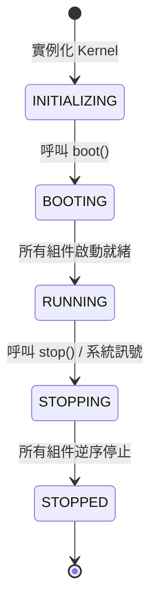
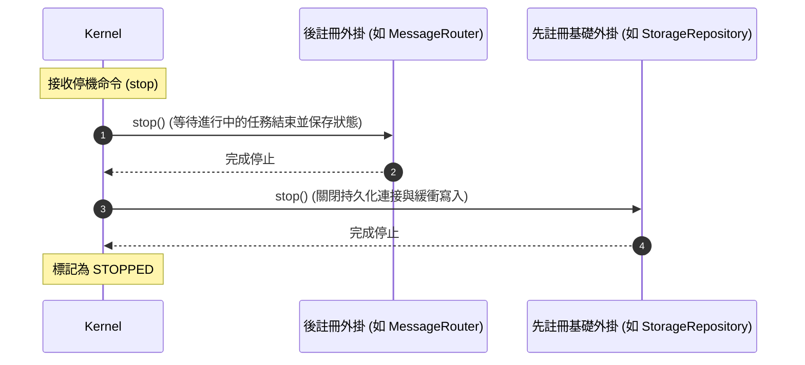

# 微內核架構與生命週期管理 (Micro-Kernel)

微內核 (`@supernova/runtime`) 是 SuperNova 系統運行的基石與依賴注入宿主，負責全域生命週期狀態機調度、服務容器池管理以及外掛的有序啟動與逆序優雅停機。

---

## 1. 核心職責與設計理念

1. **依賴注入容器 (IoC Container)**：提供全域具名服務的註冊、查詢與解析能力，避免硬編碼依賴。
2. **生命週期協調 (Lifecycle Orchestration)**：規範並嚴格執行五階段狀態流轉，確保各子系統依序就緒。
3. **優雅停機保障 (Graceful Shutdown)**：以註冊時序之嚴格相反順序（逆序）逐一停止各外掛，防止資源競爭與資料遺失。
4. **去重與熱插拔防護**：自動識別重複註冊實體，並支援在核心運行期 (`RUNNING`) 即時安裝並熱啟動新外掛。

---

## 2. 生命週期狀態機 (Lifecycle State Machine)



### 狀態說明
- **`INITIALIZING`**：核心處於構造與配置註冊階段，接受外掛註冊與靜態服務注入。
- **`BOOTING`**：啟動中，核心遍歷所有外掛隊列，依次呼叫 `install()`、`initialize()` 與 `start()`。
- **`RUNNING`**：核心就緒，開始進行訊息調度與代理思考，若配置了心跳間隔則啟動 Tick 定時器。
- **`STOPPING`**：停機中，凍結新請求，依序調用各外掛的 `stop()` 方法。
- **`STOPPED`**：核心已完全終止，所有資源與定時器均已釋放。

---

## 3. 外掛與服務介面規範

### 3.1 `IKernelPlugin` 外掛介面
所有需要參與系統生命週期的子系統均實作此介面：

```typescript
export interface IKernelPlugin {
    /** 外掛唯一名稱識別碼 */
    readonly name: string;
    /** 外掛語意化版本號 */
    readonly version?: string;

    /** 安裝外掛時注入宿主內核實例 */
    install?(kernel: IKernel): Promise<void> | void;
    /** 初始化環境、依賴與內部資源 */
    initialize?(): Promise<void> | void;
    /** 啟動背景監聽、定時任務或網路連線 */
    start?(): Promise<void> | void;
    /** 優雅停止並釋放資源 */
    stop?(): Promise<void> | void;
}
```

### 3.2 服務容器介面
微內核提供標準的服務存取方法：
- `registerService<T>(name: string, service: T): void`：註冊服務實例，若該實例具備生命週期方法，將自動納入外掛調度隊列。
- `getService<T>(name: string): T`：解析並取得指定名稱之服務實例，若不存在則拋出明確異常。
- `hasService(name: string): boolean`：檢查特定服務是否已註冊。

---

## 4. 關鍵機制實作

### 4.1 逆序優雅停機 (Reverse Order Shutdown)
為了確保後註冊的高階模組先停止、先註冊的基礎模組後停止，核心在執行 `stop()` 時維護相反的呼叫鏈：



### 4.2 去重防護與熱插拔
- **實例去重**：當同一個物件既透過 `kernel.use(plugin)` 安裝，又透過 `kernel.registerService('name', plugin)` 註冊為服務時，核心自動判定其參考唯一性，嚴格確保生命週期方法（`initialize`、`start`、`stop`）僅被觸發一次。
- **熱插拔 (Hot Plugin)**：若在核心已進入 `RUNNING` 狀態後動態呼叫 `use(plugin)`，核心將即時依序執行其 `install()`、`initialize()` 與 `start()`，並將其推入停止隊列頂部。

### 4.3 系統心跳廣播 (System Tick)
核心內建高精度心跳機制：
- 在構造時可傳入 `tickIntervalMs`（例如 1000ms）。
- 當核心進入 `RUNNING` 狀態時，自動向已註冊的事件總線定期廣播 `SystemEvent.Tick`，以驅動定時會話清理、快取淘汰與健康檢查。
