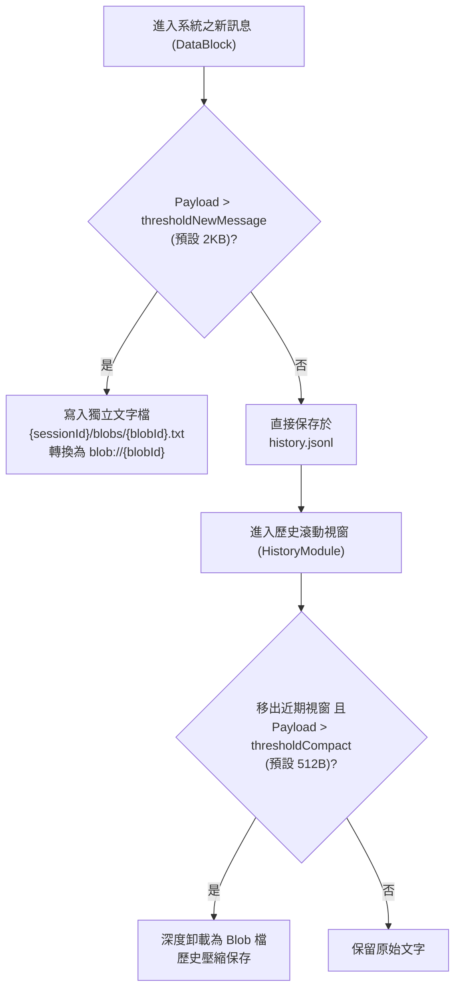

# 統一訊息載體與大資料卸載 (DataBlock)

`DataBlock` (`src/core/messaging`) 是 SuperNova 系統中跨代理人、會話與儲存庫流通的唯一標準訊息單元。它負責攜帶通訊元數據、優先級標記，並透過創新的「兩段式大資料卸載 (Two-Tier Payload Offload)」機制保障高吞吐量與輕量記憶體佔用。

---

## 1. 核心結構與介面定義

```typescript
export interface DataBlockData {
    /** 訊息唯一 UUID */
    id: string;
    /** 所屬會話 ID */
    sessionId: string;
    /** 發送者 ID (如 "user", "agent_alice") */
    senderId: string;
    /** 接收者 ID (特定 Agent ID 或廣播 "*") */
    targetId: string;
    /** 產生時間戳 (Unix 毫秒) */
    timestamp: number;
    /** 訊息優先級 */
    priority: MessagePriority;
    /** 簡短控制指令、意圖或對話本體 */
    controlPayload: string;
    /** 大型文字、程式碼或 Blob URI 參照 (如 blob://xxx) */
    dataPayload?: string;
    /** 擴展元數據標籤 */
    metadata: Record<string, any>;
}
```

### 1.1 優先級列舉 (`MessagePriority`)
- **`LOW (0)`**：背景監控指標、不急迫之日誌事件。
- **`NORMAL (1)`**：一般對話交流與例行指令。
- **`HIGH (2)`**：重要任務指令，可直接喚醒 IDLE 狀態的 Agent 進行推理。
- **`URGENT (3)`**：緊急中斷訊號（如使用者打斷、安全熔斷），優先於一般訊息派發。

---

## 2. 兩段式大資料卸載機制 (Two-Tier Offload)

為了避免超長文本、巨大程式碼片段或圖檔 Base64 塞爆記憶體與對話歷史檔案，系統實作了兩段式漸進卸載：



### 2.1 卸載策略規格
1. **第一段：新訊息即時落盤門檻 (`offload_threshold_new_message`)**：
   - 預設值：`2048` 位元組 (2KB)。
   - 當訊息進入 `DataBlockRepository.append()` 時，若負載超過門檻，即刻將資料本體寫入磁碟文字檔，原訊息欄位僅保留 URI 參照。
2. **第二段：舊歷史壓縮門檻 (`offload_threshold_compact`)**：
   - 預設值：`512` 位元組。
   - 當對話輪次持續推進、舊訊息移出未壓縮尾部（`uncompressedTail`）時，歷史器官模組以更嚴格的門檻進行第二度深層卸載，極大化精簡傳遞給 LLM 的上下文體積。
3. **全局防護開關**：
   - 配置項 `enable_payload_offload: false` 可全局關閉卸載，保持純記憶體純文字直接流轉（適用於特定調試環境）。

---

## 3. LangChain 訊息轉譯

`DataBlock` 內建與 LangChain 框架的適配方法 `toMessage(currentAgentId: string)`：
- 若 `senderId === currentAgentId`，轉換為 **`AIMessage`**（代表自身的歷史回覆）。
- 若 `senderId === 'system'`，轉換為 **`SystemMessage`**。
- 其餘情況（使用者或其他代理發送者），統一轉換為 **`HumanMessage`**，並於開頭以 `[From: {senderId}]` 標記來源身分，確保多代理對話場景中的語意邊界清晰。
