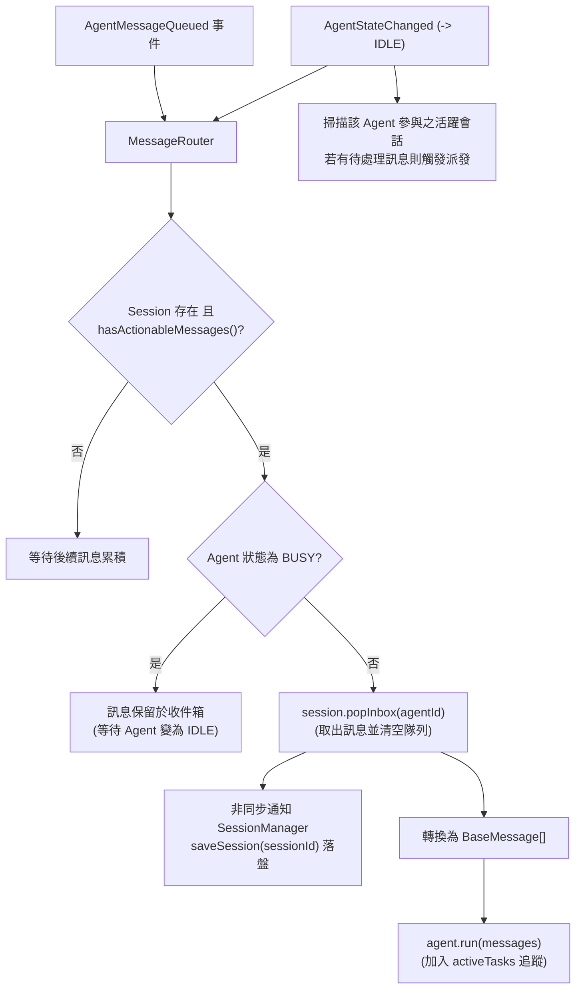
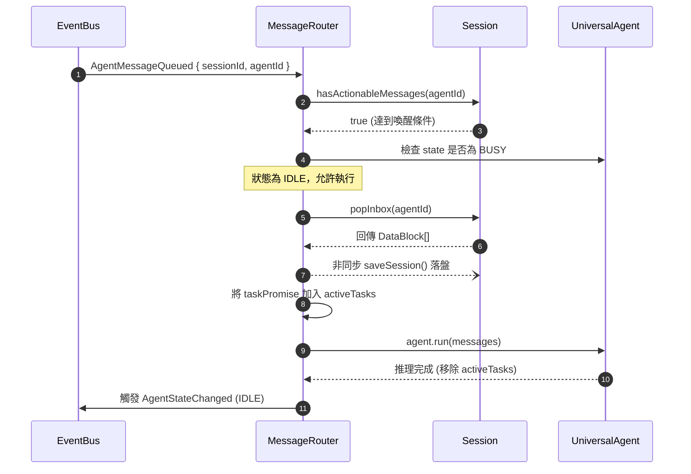

# 訊息路由器與排隊機制 (Message Router)

訊息路由器 (`src/core/messaging/MessageRouter.ts`) 是 SuperNova 系統中負責事件調度、代理人狀態感知排隊 (BUSY/IDLE)、訊息安全分發與優雅停機任務追蹤的核心通訊協調器。

---

## 1. 核心職責與運作機制



---

## 2. 關鍵排隊與防飢餓機制 (Anti-Starvation)

1. **狀態感知延遲派發**：
   - 當多方快速向同一代理人發送訊息時，若代理人正在執行長鏈路思考推理（處於 `AgentState.BUSY`），訊息路由器不會重複並行喚醒代理人造成狀態衝突，而是將訊息安全保存在會話的 `inboxBuffer` 中。
2. **空閒自動喚醒 (Idle Triggered Dispatch)**：
   - 路由器監聽 `AgentEvent.AgentStateChanged` 事件。
   - 一旦代理人完成當前輪次思考並轉回 `IDLE` 狀態，路由器立即遍歷該代理人所參與的所有會話，自動提取積壓的訊息並發起下一輪思考，徹底防止訊息餓死。
3. **消費即時落盤保障**：
   - 在執行 `session.popInbox(agentId)` 取出訊息後，路由器立即非同步呼叫 `sessionManager.saveSession(sessionId)`。
   - 確保磁碟上的 Session 檔案與記憶體狀態一致，防止伺服器異常中斷時產生重複消費。

---

## 3. 執行時序與任務追蹤 (Active Tasks)



---

## 4. 優雅停機保障 (Graceful Shutdown)

在微內核停機階段，`MessageRouter.stop()` 確保進行中的思考任務不被截斷：

```typescript
public async stop(): Promise<void> {
    this.logger.info(`Stopping MessageRouter, awaiting ${this.activeTasks.size} active tasks...`);
    
    // 等待所有目前正在進行中 (In-Flight) 的 Agent 推理任務完成
    if (this.activeTasks.size > 0) {
        await Promise.all(Array.from(this.activeTasks));
    }
    
    this.activeTasks.clear();
    this.logger.info('MessageRouter successfully stopped.');
}
```
