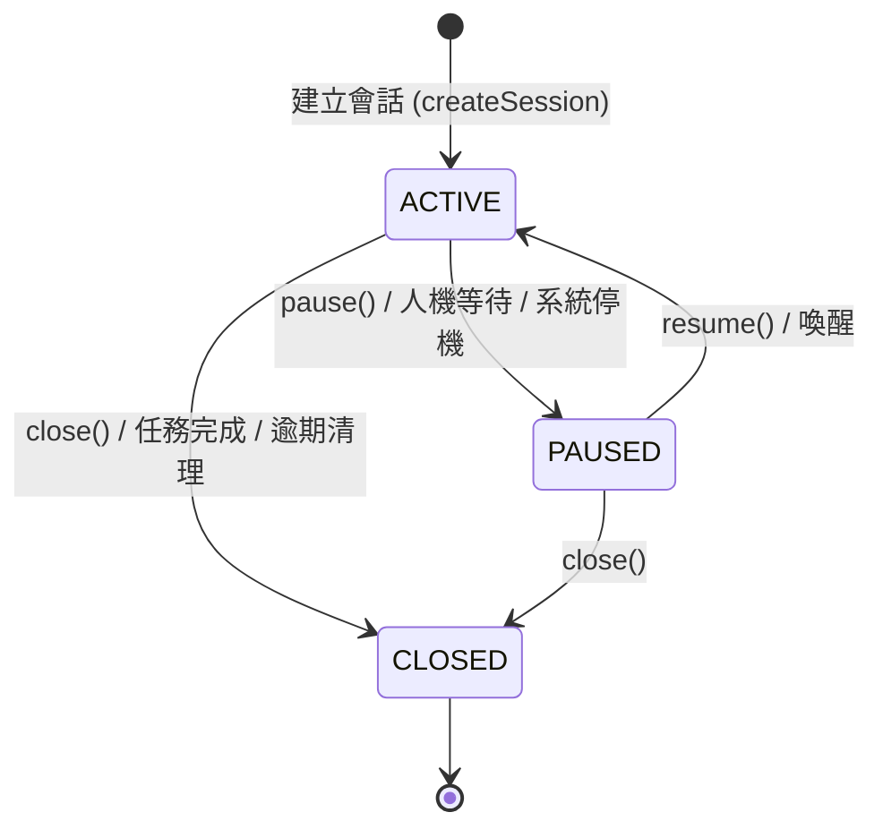
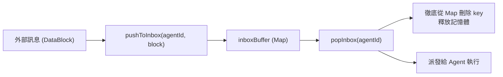

# 會話實體與狀態機 (Session)

`Session` (`src/core/session/Session.ts`) 是 SuperNova 系統中管理多代理協同上下文、成員關係以及未消費訊息隊列的領域聚合根 (Aggregate Root)。

---

## 1. 生命週期狀態機 (SessionState)



### 狀態定義
- **`ACTIVE`**：會話活躍中。收件箱可正常接收新訊息，且符合喚醒條件時可主動觸發代理人思考。
- **`PAUSED`**：會話掛起暫停。凍結代理人自主思考喚醒，新訊息仍可排入收件箱排隊等待恢復（常用於人機輸入等待或系統停機過渡）。
- **`CLOSED`**：會話已關閉歸檔。轉為唯讀狀態，嚴格拒絕接收任何新訊息（拋出明確例外）。

---

## 2. 收件箱緩衝隊列機制 (InboxBuffer)

每個會話內部維護以 `agentId` 為鍵的專屬訊息佇列：`inboxBuffer: Map<string, DataBlock[]>`。



### 2.1 關鍵佇列方法
1. **`pushToInbox(agentId, block)`**：
   - 防禦檢查：若狀態為 `CLOSED`，拒絕推入。
   - 自動將該 `agentId` 納入會話參與者名單 (`participantIds`)。
   - 追加至目標隊列並觸發 `touch()` 更新時間戳。
2. **`popInbox(agentId)`**：
   - 取出該代理人所有積壓的訊息。
   - **記憶體釋放**：直接呼叫 `this.inboxBuffer.delete(agentId)` 徹底清除鍵值，不留任何空佇列殘留。
3. **`peekInbox(agentId)`**：
   - 唯讀預覽隊列內容，不產生取出副作用。

---

## 3. 行動喚醒評估策略 (`hasActionableMessages`)

訊息路由器透過會話實體評估特定代理人是否應被立即喚醒：

```typescript
public hasActionableMessages(agentId: string, forceWakeupThreshold: number = 5): boolean {
    // 條件 1：會話必須處於活躍狀態 (PAUSED 或 CLOSED 不得自主喚醒)
    if (this.status !== SessionState.ACTIVE) return false;

    const queue = this.inboxBuffer.get(agentId);
    if (!queue || queue.length === 0) return false;

    // 條件 2：訊息積壓量達到強制喚醒門檻 (預設 5 則訊息)
    if (queue.length >= forceWakeupThreshold) return true;

    // 條件 3：存在任一高優先級 (HIGH) 或緊急中斷 (URGENT) 訊息
    return queue.some((b) => b.priority >= MessagePriority.HIGH);
}
```

---

## 4. 序列化與資料相容性

`Session` 提供精確的 JSON 序列化與反序列化工廠：
- **`toJSON(): SessionData`**：僅將存在積壓訊息的收件箱與基本元數據進行純物件轉換，確保儲存體積最小化。
- **`Session.fromJSON(data: SessionData): Session`**：自動還原狀態機、時間戳與內部的 `DataBlock` 實例佇列。


