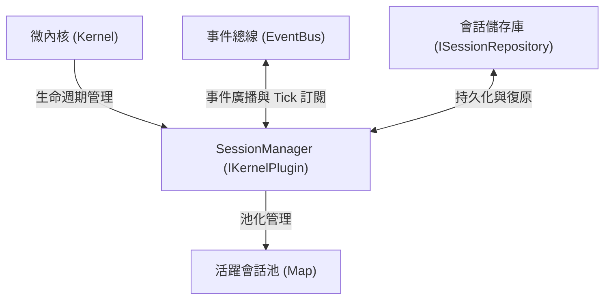
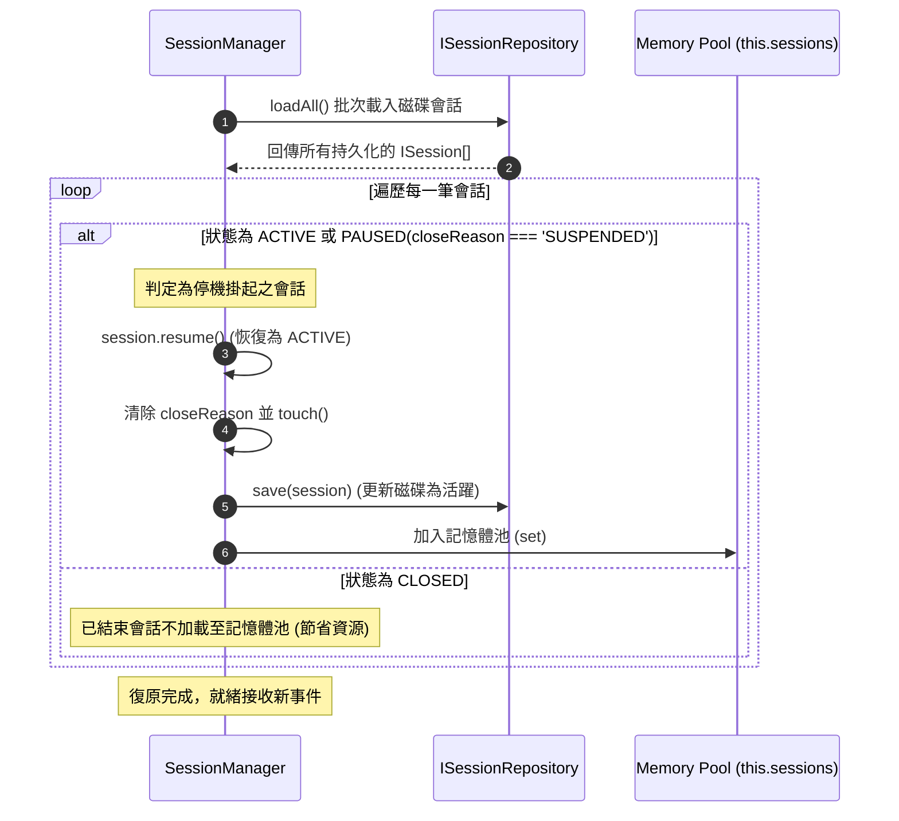

# 會話生命週期管理 (Session Manager)

會話管理器 (`src/core/session/SessionManager.ts`) 作為微內核的核心外掛服務，負責集中維護系統運行期的會話實體池 (Session Pool)、調度會話狀態流轉、執行定時閒置清理，並在系統啟動時執行自動化的**會話復原流程 (Session Recovery)**。

---

## 1. 核心職責與架構定位



1. **實例池管理 (Session Pool)**：以記憶體快取維護當前所有未關閉的會話實例，提供 O(1) 的查詢、暫停、恢復與關閉。
2. **生命週期事件廣播**：在會話建立、狀態變更與關閉時，向 EventBus 同步廣播標準事件 (`SessionStarted`, `SessionUpdated`, `SessionClosed`)。
3. **會話復原機制 (Session Recovery)**：在 `start()` 啟動期主動從磁碟儲存庫批次載入未完成會話，確保系統重啟後的會話無縫延續。
4. **優雅停機凍結 (Graceful Shutdown)**：在 `stop()` 停機期將所有活躍會話切換為 `SUSPENDED` 並非同步批次保存至儲存庫。

---

## 2. 會話復原流程 (Session Recovery Flow)

當微內核開機啟動 `SessionManager.start()` 時，若配置了儲存庫，會自動執行會話復原：



---

## 3. 定時逾期閒置回收 (Idle Cleanup)

在配置了 `autoCleanupIdleMs > 0` 的情況下，`SessionManager` 自動訂閱 `SystemEvent.Tick`：

```typescript
public cleanupExpiredSessions(maxIdleMs: number): number {
    const now = Date.now();
    let cleanedCount = 0;

    for (const session of this.sessions.values()) {
        if (session.status !== SessionState.CLOSED) {
            const idleTime = now - session.updatedAt;
            if (idleTime >= maxIdleMs) {
                // 逾期超時，自動關閉並存檔至儲存庫
                this.closeSession(session.id, 'IDLE_TIMEOUT');
                cleanedCount++;
                this.logger.warn(`Session [${session.id}] expired after ${idleTime}ms idle time`);
            }
        }
    }

    return cleanedCount;
}
```

---

## 4. 關鍵介面規範

```typescript
export interface ISessionManager {
    createSession(params?: SessionParams): ISession;
    getSession(sessionId: string): ISession | undefined;
    hasSession(sessionId: string): boolean;
    listSessions(): ISession[];
    getActiveSessions(): ISession[];
    closeSession(sessionId: string, reason?: string): boolean;
    pauseSession(sessionId: string): boolean;
    resumeSession(sessionId: string): boolean;
    removeSession(sessionId: string): boolean;
    saveSession(sessionId: string): Promise<void>;
    loadSession(sessionId: string): Promise<ISession>;
    cleanupExpiredSessions(maxIdleMs: number): number;
    recoverSessions?(): Promise<number>;
}
```
