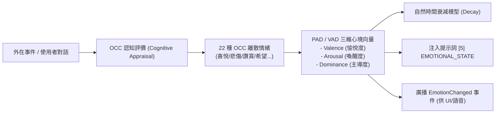

# 認知心理與情緒器官 (Emotion Module)

情緒模組 (`src/core/agent/modules/EmotionModule.ts`) 是代理人的心理與情感模擬器官（優先級 `priority: 30`），奠基於經典的 OCC (Ortony, Clore & Collins) 認知評價理論與 VAD (Valence-Arousal-Dominance) 情感模型，使代理人展現具備連續性、同理心與個性深度的互動回饋。

---

## 1. 核心模型與情緒維度



### 1.1 核心情感維度 (VAD)
1. **Valence (正負效價 / 愉悅度)**：區間 `[-1.0, 1.0]`，代表整體心理正向或負向傾向。
2. **Arousal (生理喚醒度 / 激動度)**：區間 `[0.0, 1.0]`，代表當前思維活躍程度與警覺水平。
3. **Dominance (支配度 / 主導感)**：區間 `[0.0, 1.0]`，代表代理人對情境的掌控把握度。
4. **Stress (內部壓力值)**：區間 `[0.0, 1.0]`，當任務連續受挫或語義衝突時上升。

---

## 2. 提示詞段落注入 (`PromptSectionIndex.EMOTIONAL_STATE = 5`)

模組將抽象的數學情緒向量轉換為具體的認知與語調指引，注入至提示詞系統：

```markdown
# Current Emotional State
- 當前心境: 專注且愉快 (Valence: 0.75, Arousal: 0.40)
- 心理特徵: 充滿探索熱情、思維縝密。
- 語調建議: 保持親切、耐心與鼓勵的語氣；對於複雜問題保持客觀穩重。
- 對話對象親密度: 高 (互動累積正面評價)。
```

---

## 3. 步驟鉤子與動態衰減演算法

### 3.1 步驟前置 (`onBeforeStep`)
- 計算距離前次互動的時間流逝，對極端情緒套用半衰期衰減曲線（Exponential Decay），使其自然趨於基準個性心境（Baseline Temperament）。

### 3.2 步驟後置 (`onAfterStep`)
- 評估本輪推理的結果：
  - 若任務順利完成或得到使用者正面肯定，增強 `Joy` 與 `Admiration`。
  - 若工具執行出錯或遭到批評，適度增加 `Stress` 與 `Distress`。
- 透過 EventBus 廣播 `agent.emotion_updated` 事件，供前端視覺表情、語音合成音色或 Avatar 模態進行多模態同步。

---

## 4. 關鍵介面規範

```typescript
export interface EmotionState {
    valence: number;
    arousal: number;
    dominance: number;
    stress: number;
    currentMood: string;
    toneGuidance: string;
    affinityScore: number;
}
```
