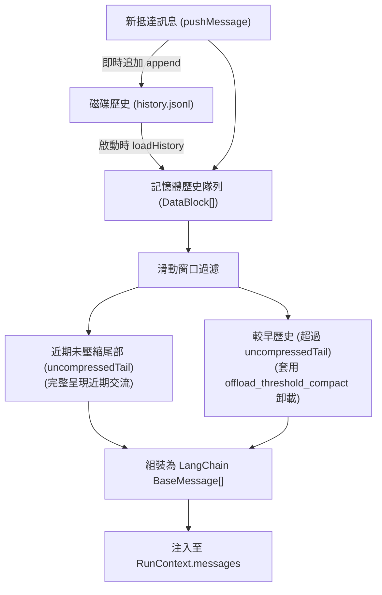

# 會話歷史與滑動窗口器官 (History Module)

歷史模組 (`src/core/agent/modules/HistoryModule.ts`) 是代理人的記憶載入與上下文流轉器官（優先級 `priority: 10`），負責管理當前會話的線性對話歷史、滑動窗口壓縮、上下文組裝，以及配合兩段式大資料卸載以維持上下文視窗的最佳體積。

---

## 1. 核心職責與特性

1. **歷史軌跡維護**：串接 `IDataBlockRepository`，於記憶體維護快取的對話歷史隊列，並即時寫入 `{sessionId}/agents/{agentId}/history.jsonl`。
2. **滑動窗口管理 (Sliding Window)**：
   - 限制送入模型的最大歷史條數 (`maxMessages`)。
   - 保留最新的未壓縮尾部 (`uncompressedTail`，如最近 4 條對話)，確保近期對話細節完整呈現。
3. **兩段式大資料深度卸載**：
   - 新訊息即時寫入時，以 `offload_threshold_new_message`（2KB）門檻進行初步卸載。
   - 當舊對話被移出近期未壓縮尾部時，以更嚴格的 `offload_threshold_compact`（512B）門檻執行二次深層卸載。
4. **LangChain 訊息序列組裝**：在 `onBeforeStep` 鉤子中，將歷史對話與新抵達訊息有序組合成 `BaseMessage[]`，無縫傳遞給後續推理步驟。

---

## 2. 歷史資料流與滑動窗口架構



---

## 3. 步驟鉤子執行時序

### 3.1 推理前置鉤子 (`onBeforeStep`)
1. 讀取當前會話與代理人 ID。
2. 從快取隊列中取出符合滑動窗口門檻的歷史資料塊。
3. 轉換為 LangChain 訊息實例（`AIMessage`、`HumanMessage`、`SystemMessage`）。
4. 將組合後的序列覆蓋寫入 `context.messages`，供模型調用使用。

### 3.2 推理後置鉤子 (`onAfterStep`)
1. 檢查 `context.modelResponse` 是否產生了模型回答。
2. 若存在回答，自動封裝為具備 `senderId: agentId` 的新 `DataBlock`。
3. 調用儲存庫 `repo.append(dataBlock)` 即刻以 JSONL 格式落盤。
4. 若存在工具呼叫結果 (`toolResults`)，依序追加落盤，確保對話軌跡百分之百完整重現。

---

## 4. 關鍵配置規格

```typescript
export interface HistoryModuleConfig {
    /** 視窗保留之最大歷史訊息數量 (預設 20) */
    maxMessages: number;
    /** 保留完整內容不進行深度壓縮的最新訊息數量 (預設 4) */
    uncompressedTail: number;
    /** 是否啟用大資料檔案卸載開關 */
    enablePayloadOffload: boolean;
    /** 新訊息落盤門檻 (位元組，預設 2048) */
    offloadThresholdNewMessage: number;
    /** 舊歷史壓縮門檻 (位元組，預設 512) */
    offloadThresholdCompact: number;
}
```
