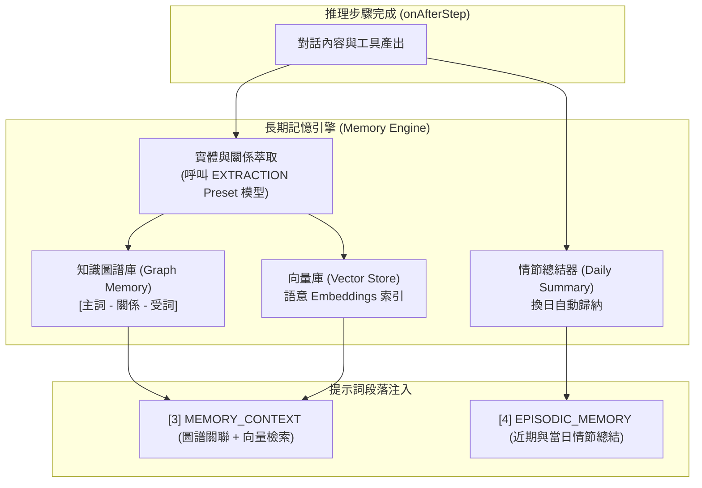

# 長期記憶與語意圖譜器官 (Memory Module)

記憶模組 (`src/core/agent/modules/MemoryModule.ts`) 是代理人的長期認知沉澱器官（優先級 `priority: 20`），結合結構化知識圖譜 (Knowledge Graph)、向量相似檢索與換日情節總結 (Daily Summary)，實現跨越會話週期的終身學習。

---

## 1. 核心職責與記憶體系



1. **圖譜記憶 (Graph Memory)**：以實體節點 (Entity Nodes) 與關聯邊 (Relation Edges) 儲存概念網絡（例如「使用者-偏好-TypeScript」、「專案-採用-微內核架構」）。
2. **向量語意檢索 (Vector Similarity Search)**：將過往重要問答片段向量化，根據當前訊息語意關聯性召回 Top-K 記憶切片。
3. **每日情節總結 (Daily Episodic Summary)**：定時監聽換日事件 (`00:00`)，將前一日的分散對話歸納為高階情節敘事，防止細節膨脹。
4. **低成本背景萃取**：在 `onAfterStep` 階段非同步發起記憶提取，調度專用之 `EXTRACTION` 模型預設，不阻塞主要思考流程。

---

## 2. 提示詞段落貢獻

記憶模組貢獻兩組核心語意段落：

### 2.1 語意圖譜與向量召回 (`PromptSectionIndex.MEMORY_CONTEXT = 3`)
- 在 `onBeforeStep` 時，根據當前使用者的輸入在圖譜與向量庫中進行聯合查詢。
- 格式化為緊湊的 Markdown 實體關聯清單：
  ```markdown
  # Memory Context
  [相關知識實體]
  - 使用者 (User): 偏好 TypeScript、強調嚴格型別、重視代碼不可破壞性。
  - SuperNova: 組合式架構、一切皆模組、優先級調度。
  ```

### 2.2 情節記憶 (`PromptSectionIndex.EPISODIC_MEMORY = 4`)
- 注入最近數日的高階對話總結：
  ```markdown
  # Episodic Memory
  [近期事件回憶]
  - 2026-09-21: 完成了 V2 組合式模組架構設計。
  - 2026-09-23: 重構了 SessionManager 重啟復原機制與大資料兩段式卸載。
  ```

---

## 3. 模組內建工具清單 (`getTools`)

記憶模組為語言模型提供主動管理記憶的標準工具：

1. **`recall_memory`**：
   - 參數：`query: string, limit?: number`
   - 功能：依據自訂關鍵字主動深入檢索圖譜與向量資料庫。
2. **`store_entity_relation`**：
   - 參數：`subject: string, predicate: string, object: string`
   - 功能：由代理人主動記錄使用者宣稱之長期事實與偏好三元組。
3. **`update_concept`**：
   - 參數：`entityName: string, description: string`
   - 功能：修正或擴充既有實體的屬性定義。

---

## 4. 倉儲層實作與沙盒目錄規範 (JsonGraphRepository)

記憶與圖譜倉儲嚴格遵循 Clean Architecture，透過繼承 `@supernova/storage` 的 `BaseJsonRepository` 實現持久化：

- **節點儲存 (Nodes)**：`sessions/<sessionId>/graph/nodes.json`
- **關聯邊儲存 (Edges)**：`sessions/<sessionId>/graph/edges.json`
- **向量庫索引 (Vectra Index)**：`sessions/<sessionId>/graph/index/`
- **每日情節總結 (Summaries)**：`sessions/<sessionId>/summaries/YYYY-MM-DD.md`

### 4.1 依賴注入 (Dependency Injection)
`JsonGraphRepository` 作為外部全域單例由 IoC 容器或應用入口實例化，並以依賴注入方式傳入 `MemoryModule`：

```typescript
const graphRepo = new JsonGraphRepository({ storage: storageConfig });
const memoryModule = new MemoryModule({
    repository: graphRepo,
    sessionId: session.id,
    extractionPresetName: 'EXTRACTION',
    topK: 3,
    subgraphDepth: 1,
});
await agent.attachModule(memoryModule);
```

### 4.2 主動萃取介面 (`extractMemory`)
除了在 `onAfterRun` 階段自動進行非同步背景萃取外，`MemoryModule` 亦暴露了公開的 `extractMemory` 方法，供批次對話匯入、手動觸發或測試腳本使用：

```typescript
// 主動提取對話文本並等待圖譜落盤完成
await memoryModule.extractMemory(conversationText, sessionId);
```

---

## 5. 測試驗證與覆蓋

記憶器官具備多層級的嚴格驗證機制：

1. **單元測試 (`src/core/__tests__/MemoryModule.test.ts`)**：
   - 驗證器官依賴完整性（缺少 `profile` 或 `history` 時拒絕掛載）。
   - 驗證步驟前置向量檢索與 `PromptSectionIndex.MEMORY_CONTEXT` 的 Markdown 格式注入。
   - 驗證推理步驟後非同步背景抽取與圖譜持久化。
2. **圖譜倉儲測試 (`src/core/__tests__/JsonGraphRepository.test.ts`)**：
   - 驗證節點與邊的 CRUD、級聯刪除清理 (Cascade Delete)。
   - 驗證 Vectra 向量索引建立與相似度檢索 (`searchNodesByVector`)。
   - 驗證多階子圖拓撲展開 (`getSubgraph`) 與聯合檢索 (`searchGraphContext`)。
3. **端到端實機測試 (`demo/test_memory.ts`)**：
   - 透過 `bun run test:memory` 執行真實對話萃取、磁碟檔案檢查、語意關聯搜尋與 `recall_memory` 工具主動調用。


