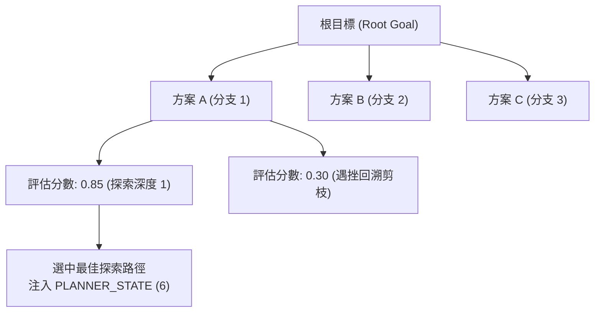

# 目標分解與樹狀規劃器官 (Planner Module)

規劃模組 (`src/core/agent/modules/PlannerModule.ts`) 是代理人的長鏈路目標拆解與決策搜尋器官（優先級 `priority: 40`），融合語言樹搜尋 (Language Agent Tree Search, LATS) 與階層式任務網絡 (Hierarchical Task Network, HTN)，賦予代理人應對複雜工程與長程推導的系統性解題能力。

---

## 1. 核心模型：LATS 樹狀探索架構

面對高度不確定性或多步驟分支的複雜任務，規劃模組打破傳統線性鏈路，維護樹狀決策拓撲：



### 1.1 四大決策階段
1. **擴展 (Expansion)**：針對當前目標，生成多個潛在的步驟分支與工具調用策略。
2. **模擬評估 (Simulation / Valuation)**：評估每個路徑的可行性、預期風險與效益，產生數值化信心分數。
3. **回溯剪枝 (Backtracking & Pruning)**：若某一路徑遭遇執行錯誤或邏輯死結，自動回溯至上一有效節點並重構替代計劃。
4. **反思更新 (Self-Reflection)**：在失敗中提取經驗沉澱至 `RunContext.state`，避免重複嘗試無效路徑。

---

## 2. 提示詞段落注入 (`PromptSectionIndex.PLANNER_STATE = 6`)

模組在 `onBeforeStep` 中將當前規劃的結構化進度注入至提示詞：

```markdown
# Current Plan & Progress
[全域目標]: 完成系統架構文檔重建與規格落實
[執行清單]:
1. [✓] 建立全局 ARCH.md 與系統總覽
2. [✓] 建立微內核與執行期架構規範 (Kernel)
3. [✓] 建立通訊與會話子系統架構規範 (Messaging)
4. [✓] 建立組合式代理人容器規範 (Agent)
5. [▶] 建立標準器官模組詳細規範 (Modules) - [當前執行中]
6. [ ] 建立任務編排與儲存架構規範 (Task & Storage)
7. [ ] 建立全域 API 與事件規格 (API)
[下一步行動策略]: 依序完善後續器官模組與任務編排文檔。
```

---

## 3. 模組內建工具清單 (`getTools`)

規劃模組為語言模型提供結構化修改與反思規劃的標準工具：

1. **`create_plan`**：
   - 參數：`goal: string, steps: string[]`
   - 功能：初始化全新的多步驟任務拓撲。
2. **`update_plan_step`**：
   - 參數：`stepIndex: number, status: 'PENDING' | 'IN_PROGRESS' | 'COMPLETED' | 'FAILED', notes?: string`
   - 功能：更新特定步驟的進度狀態並記錄反思備註。
3. **`replan_from_failure`**：
   - 參數：`failedStepIndex: number, reason: string, newSteps: string[]`
   - 功能：觸發路徑重構，在保留已完成成果的前提下動態調整後續路徑。
