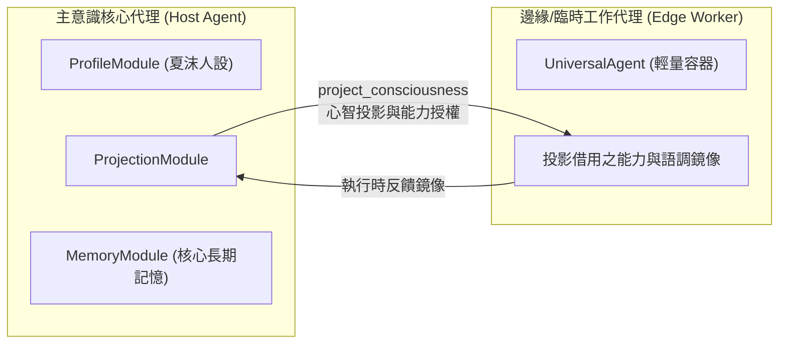

# 意識投影與能力借用器官 (Projection Module)

投影模組 (`src/core/agent/modules/ProjectionModule.ts`) 是代理人的跨實體心智投射與器官借用器官（優先級 `priority: 50`），使主意識核心代理能夠跨越會話邊界，將部分人格特徵、高階工具或特定器官能力動態借調至其他邊緣或遠端代理人身上運行。

---

## 1. 核心設計理念與架構

### 1.1 核心能力特色
1. **心智鏡像 (Mind Mirroring)**：在遠端執行特定專案或外派任務時，臨時節點可具備與主核心高度一致的語調、處事原則與溝通標準。
2. **非對稱器官借用 (Asymmetric Organ Borrowing)**：邊緣節點通常不常駐昂貴的長期記憶或樹狀規劃模組；透過投影通道，邊緣節點可按需向核心借用推理能力。
3. **投影生命週期受控**：支援設置投影超時時間（TTL）與明確撤回指令，防止特權與身分擴散。

---

## 2. 模組內建工具清單 (`getTools`)

1. **`project_consciousness`**：
   - 參數：`targetAgentId: string, durationMs?: number, borrowModules?: string[]`
   - 功能：向目標代理人發起心智投射協議，動態綁定指定之能力配置。
2. **`recall_projection`**：
   - 參數：`targetAgentId: string`
   - 功能：強制撤回投射於目標代理人身上的特權與鏡像狀態，使其回歸原生配置。
