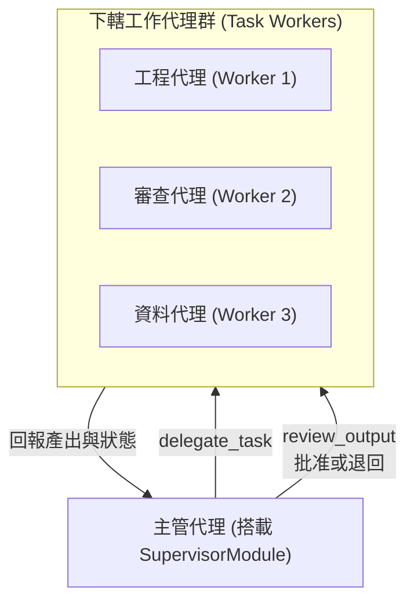

# 代理協同與監督器官 (Supervisor Module)

監督模組 (`src/core/agent/modules/SupervisorModule.ts`) 是代理人的組織調度與授權管理器官（優先級 `priority: 40`），負責在多代理協同場景中擔任群體指揮核心，進行任務指派、權限動態審查、品質驗收與衝突仲裁。

---

## 1. 核心職責與衝突防護



### 1.1 模組排斥規則 (`conflicts`)
- 監督模組的職責為「指揮、授權與驗收」，因此明確聲明與 `task_worker` 模組互斥：
  ```typescript
  public readonly conflicts = ['task_worker'];
  ```
- 容器在裝配時若檢測到同時掛載這兩類模組，將立即拋出配置衝突異常，保障責任單一原則。

---

## 2. 核心工作機制

1. **子任務動態委派 (Dynamic Delegation)**：
   - 根據規劃模組分解的子目標，評估各 Worker Agent 的專長與當前負載狀態，發起精準派發。
2. **權限動態審查 (Permission Evaluation)**：
   - 當下轄代理人嘗試執行高風險操作（如刪除資料庫、呼叫外部扣費 API、執行危險 Shell 命令）時，需向 Supervisor 發起權限申請，由 Supervisor 進行合規驗證後簽發一次性 Token。
3. **成果品質門禁 (Quality Gates)**：
   - Worker 回傳的產出必須經過 Supervisor 的驗收審查；若未達驗收標準，則附加退回意見並要求其重新執行。

---

## 3. 模組內建工具清單 (`getTools`)

1. **`delegate_subtask`**：
   - 參數：`targetAgentId: string, instruction: string, timeoutMs?: number`
   - 功能：將指定的工作指令推送至目標代理人的專屬會話隊列。
2. **`review_task_result`**：
   - 參數：`taskId: string, approved: boolean, feedback?: string`
   - 功能：裁決 Worker 回傳之任務成果，若 `approved: false` 則觸發重試機制。
3. **`terminate_worker_task`**：
   - 參數：`targetAgentId: string, reason: string`
   - 功能：強制中斷失去回應或死結中的 Worker 任務。
