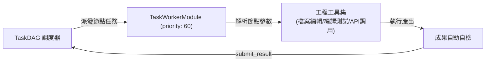

# 任務執行與節點工作者器官 (Task Worker Module)

任務工作者模組 (`src/core/agent/modules/TaskWorkerModule.ts`) 是專注於執行具體工作單元與任務節點的執行器官（優先級 `priority: 60`），通常掛載於各類特化 Worker 代理人中，負責接收 TaskDAG 節點、解析輸入、調用工程工具並回報成果。

---

## 1. 核心職責與設計原則

1. **專注執行 (Execution-Focused)**：去除高階組織管理開銷，專注於高效理解具體輸入、產出程式碼、檔案或運算結果。
2. **與 Supervisor 互斥**：聲明 `conflicts: ['supervisor']`，保證架構邊界不發生角色錯亂。
3. **任務節點狀態同步**：即時向全域事件總線或 TaskDAG 引擎回報心跳與進度。

---

## 2. 模組內建工具清單 (`getTools`)

1. **`report_task_progress`**：
   - 參數：`taskId: string, percentage: number, currentActivity: string`
   - 功能：更新當前執行節點的百分比進度與當前操作摘要。
2. **`submit_task_result`**：
   - 參數：`taskId: string, outputPayload: any, artifacts?: string[]`
   - 功能：提交已完成之任務成果資料及產生物件路徑，標記該節點為 `COMPLETED`。
3. **`report_task_error`**：
   - 參數：`taskId: string, errorMessage: string, recoverable: boolean`
   - 功能：當遭遇不可克服的錯誤時發起失敗通報，由調度器決定重試或回溯。
