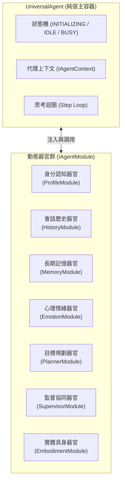
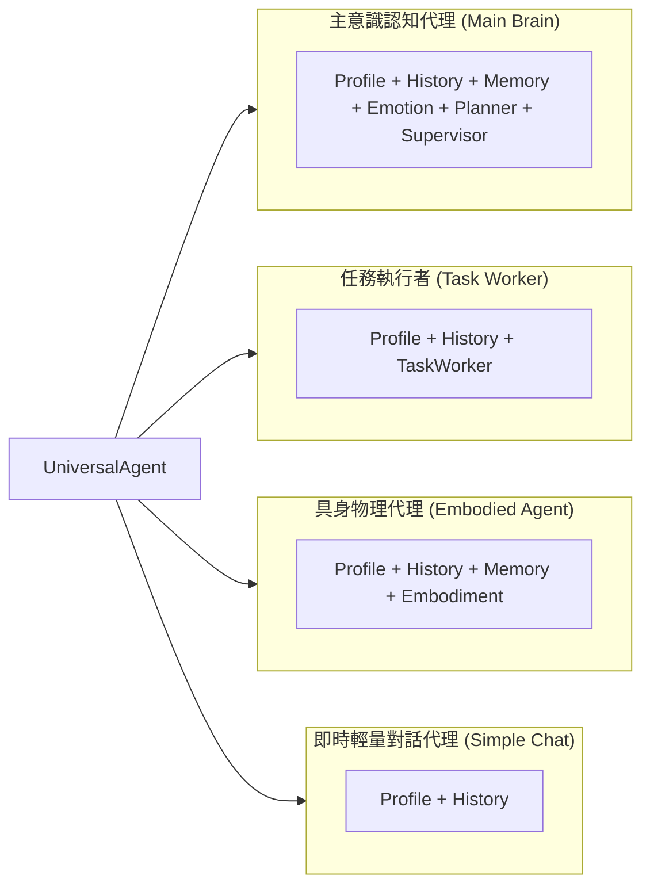

# 系統架構哲學與核心設計模式 (Overview)

本文件深入闡述 SuperNova 的底層設計理念、架構模式選擇、核心抽象原則以及在分散式多代理系統中所採取的工程設計準則。

---

## 1. 核心哲學：器官化組合 (Everything is an Organ)

傳統物件導向中，以階層式類別繼承（Inheritance Hierarchy）來擴展代理人能力往往會遭遇繼承樹深層化、職責交疊與上下文狀態汙染等挑戰。

SuperNova 確立了**「一切皆模組、器官化組合」**的核心哲學：

### 1.1 容器與器官的分工邊界
- **宿主容器 (`UniversalAgent`)**：
  - 核心程式碼嚴格控制在 400 行以內。
  - 不包含任何具體的業務決策、人設定義、記憶檢索或特定領域工具。
  - 僅提供：
    1. 模組註冊、依賴性驗證與衝突排斥機制。
    2. 推理生命週期排程（BeforeStep、Prompt 組裝、工具收集、呼叫模型、AfterStep）。
    3. 執行期狀態機流轉與錯誤防護。
- **器官模組 (`IAgentModule`)**：
  - 所有具體的代理人能力均作為獨立的器官模組。
  - 模組具備自洽的內部狀態、生命週期鉤子、提示詞段落貢獻與工具提供能力。
  - 模組之間嚴禁直接互相引用（Direct Import），所有資料互動均透過 `RunContext` 與 `EventBus` 進行鬆散解耦。

---

## 2. 核心架構模式 (Core Architectural Patterns)

### 2.1 微內核架構 (Micro-Kernel Architecture)
SuperNova 以 `@supernova/runtime` 的 `Kernel` 作為全域宿主。
- **最小核心**：核心僅維護生命週期狀態（`INITIALIZING` → `BOOTING` → `RUNNING` → `STOPPING` → `STOPPED`）、服務登記表與外掛隊列。
- **全外掛化**：訊息路由、會話管理、LLM 工廠乃至背景監控工作均實作 `IKernelPlugin`，享有統一的初始化、啟動與逆序優雅停機（Reverse Graceful Shutdown）保證。

### 2.2 事件驅動與非同步解耦 (Event-Driven Architecture)
跨組件通訊採用強型別的 `EventBus`：
- **時間解耦**：生產者在發佈事件（如訊息抵達、代理狀態變更、推理步驟完成）後立即完成回傳，不被消費者的處理時長阻塞。
- **空間解耦**：模組無需知曉消費者的具體存在或實體參考，透過訂閱共同約定的事件協議即可實現多方協同與監聽。

### 2.3 儲存庫模式與分層資料卸載 (Repository Pattern & Tiered Offload)
為了在有限的記憶體與上下文視窗中支援無限期的持久對話，系統在資料流轉上實施三層分離：
1. **即時會話元數據 (Session Data)**：管理進行中的對話狀態、信箱緩衝與成員標記，以獨立 JSON 儲存，並於重啟時完整恢復。
2. **線性訊息軌跡 (Message Track)**：對話紀錄即時以 JSONL（每行一筆 DataBlock）追加至各代理專屬的歷史檔案，確保寫入吞吐量與當機防禦。
3. **大型負載卸載 (Large Payload Blobs)**：文字、巨量程式碼或 Base64 圖片等大型資料，自動依「新訊息門檻」與「歷史壓縮門檻」卸載為獨立 Blob 文字檔，訊息本體僅保留輕量抽象指標。

---

## 3. 模組組合預設工廠 (Preset Configurations)

透過自由插拔器官模組，同一套 `UniversalAgent` 容器能夠具現化為多種專業角色：

---

## 4. 嚴格型別與不可破壞性準則

1. **強制 Zod Schema 驗證**：
   - 拒絕未經校驗的動態參數與 `any` 擴展，外部輸入（配置檔、網絡請求、工具呼叫回傳）必須通過嚴格的 Zod Schema 解析。
2. **不可變資料結構 (Immutability)**：
   - 配置管理器在完成多來源聚合後對配置物件執行深層凍結 (`Object.freeze`)，防止執行期非預期篡改。
3. **優雅停機保障 (Graceful State Preservation)**：
   - 任何系統終止訊號均觸發多階段停機管線：拒絕新請求 → 等待進行中任務完成 → 凍結記憶體活躍狀態至磁碟 → 釋放資源。
