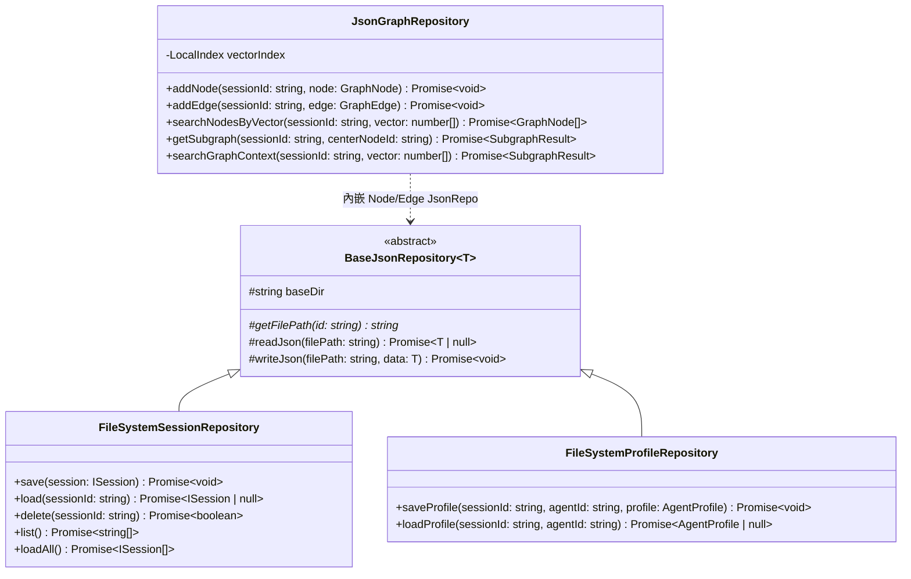

# 儲存庫模式與資料存取規範 (Repository Pattern)

儲存庫模式 (`@supernova/storage`) 是 SuperNova 系統中隔離領域業務邏輯與底層物理儲存媒介（本地磁碟、檔案系統或未來資料庫）的標準架構抽象。

---

## 1. 核心抽象體系



---

## 2. 外部依賴注入原則 (IoC Singleton Injection)

為避免各器官模組內部私自實例化倉儲造成快取不一致與檔案控制代碼（File Handle）衝突，所有倉儲實例**必須且只能在應用程式進入點或微內核容器外部統一創建單例**，再透過建構子注入各模組：

```typescript
// 1. 外部統一實例化倉儲單例
const sessionRepo = new FileSystemSessionRepository({ storage: storageConfig });
const dataBlockRepo = new FileSystemDataBlockRepository({ storage: storageConfig, agent: agentConfig });
const profileRepo = new FileSystemProfileRepository({ storage: storageConfig });
const graphRepo = new JsonGraphRepository({ storage: storageConfig });

// 2. 透過依賴注入裝配至外掛與器官模組
const sessionManager = new SessionManager({ repository: sessionRepo });
const profileModule = ProfileModule.load('main_agent', { storage: storageConfig }, false, {
    sessionId: session.id,
    repository: profileRepo,
});
const memoryModule = new MemoryModule({
    repository: graphRepo,
    sessionId: session.id,
});
```

---

## 3. 安全性與原子性保障


1. **路徑穿越防護 (Path Traversal Protection)**：
   - 所有的具體儲存庫在解析目標檔案路徑時，嚴格對使用者傳入之識別碼套用 `path.basename()` 或嚴格的白名單正則檢查，徹底防止 `../../` 惡意檔案逃逸。
2. **原子化寫入保障 (Atomic Write)**：
   - 底層實作先寫入暫存檔案（`.tmp`），完成後透過檔案系統的原子更名操作 (`fs.rename`) 覆蓋目標檔案，防止在磁碟寫入中途因當機造成 JSON 檔案損毀。
3. **目錄自愈與自動建立**：
   - 在執行寫入前，自動檢查並遞迴建立不存在的父層目錄（`mkdir -p` 語意）。
