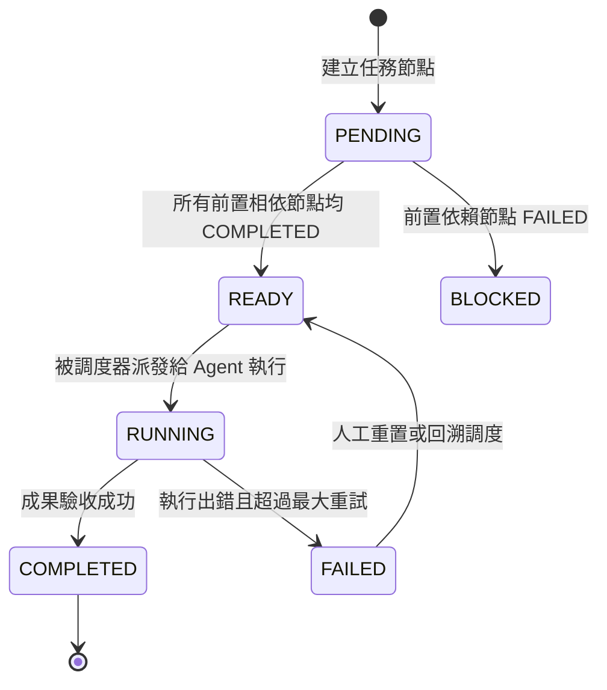

# 有向無環任務圖 (TaskDAG)

任務拓撲圖 (`src/core/task/TaskDAG.ts`) 是 SuperNova 用於表示複雜多步驟、多代理協同任務相依關係的有向無環圖 (Directed Acyclic Graph) 核心資料結構。

---

## 1. 核心結構與節點狀態機



### 1.1 節點資料模型 (`TaskNode`)
```typescript
export interface TaskNode {
    /** 節點唯一識別碼 */
    readonly id: string;
    /** 任務標題 */
    title: string;
    /** 詳細任務目標與規格描述 */
    description: string;
    /** 當前執行狀態 */
    status: TaskStatus;
    /** 依賴的前置節點 ID 清單 */
    dependencies: string[];
    /** 輸入參數或上下文參照 */
    inputPayload: Record<string, any>;
    /** 執行產出結果 */
    outputPayload?: Record<string, any>;
    /** 已重試次數 */
    retryCount: number;
    /** 最大允許重試次數 */
    maxRetries: number;
    /** 指定或已分派之代理人 ID */
    assignedAgentId?: string;
}
```

---

## 2. 拓撲排序與環路檢測演算法

在新增節點或相依邊（`addDependency(fromId, toId)`）時，引擎基於 Kahn 演算法即時檢測拓撲合法性：
1. **入度統計 (In-Degree Calculation)**：統計各節點未完成的前置相依數量。
2. **死結與環路防護**：若在依賴圖中檢測到環（Cycle），立即拒絕變更並拋出異常，防止任務調度產生永久死鎖。
3. **就緒節點提取 (`getReadyNodes`)**：快速篩選所有狀態為 `PENDING` 且所有依賴均已處於 `COMPLETED` 的節點，流轉為 `READY` 並提交給調度器。

---

## 3. 動態圖演進 (Dynamic Graph Evolution)

TaskDAG 支援在執行期根據代理人的思考反饋進行動態擴展：
- 允許在運行過程中動態插入子節點（Subtask Insertion）。
- 支援標記部分節點為 `SKIPPED`，並自動觸發下游相依節點的就緒條件更新。
