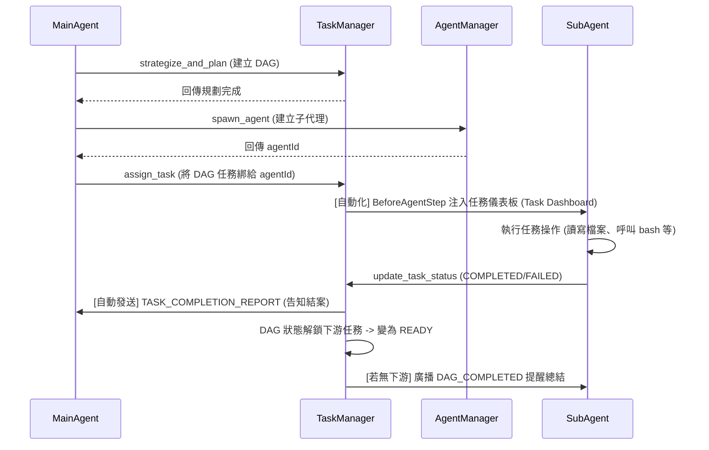

# Task 指派與調度閉環設計 (Task Dispatch & Orchestration Loop)

## 1. 核心理念：解耦與事件驅動

在 SuperNova 中，任務 (Task) 與執行者 (Agent) 之間的調度不依賴強制綁定的生命週期，而是透過 **事件驅動 (Event-Driven)** 與 **任務狀態機 (Task State Machine)** 達成靈活的調度閉環：

- **MainAgent / Creator 是決策者**：負責切分任務、決定何時 spawn_agent、並透過 `assign_task` 指派任務給特定的子代理。
- **TaskManager 是大管家**：負責維護所有 Task 的 DAG (有向無環圖) 狀態、追蹤相依性 (Dependencies)，並在適當時機自動推播任務就緒或結案通知。
- **單一職責綁定**：一個 Agent 同時只能被指派 **一個** 任務。當該任務完成後，若有下游任務，TaskManager 會根據其依賴展開。

## 2. 核心元件與工具

### 2.1 SpawnAgentTool
- **職責**：單純負責「建立」一個全新的 Agent（可選 `PERSISTENT` 或 `VOLATILE`），並賦予他初期的 Objective 指令。
- **不綁定任務**：它不會將 Agent 綁定到 DAG 中的任何 `taskId`。新建立的 Agent 處於遊離狀態，直到被指派任務。
- **廣播指令**：建立後，會向該 Agent 發送 `TASK_ASSIGNMENT` 類型的系統廣播，讓 Agent 知道自己誕生的目的。

### 2.2 AssignTaskTool
- **職責**：將已經在 DAG 系統中註冊的任務 (`taskId`)，綁定給一個活著的 Agent (`agentId`)。
- **互斥鎖檢查**：工具內會嚴格檢查 `agent.assignedTaskId`，如果該 Agent 目前已經在執行其他任務，將會拒絕指派，避免狀態混亂。
- **狀態連動**：指派成功後，不僅會在 `ITask.assignedAgentId` 記錄，同時也會將 `taskId` 寫入 `agent.assignedTaskId`。

### 2.3 UpdateTaskStatusTool
- **職責**：當 Agent 判斷任務執行完畢（或遭遇不可逆錯誤）時，用來回報最終結果。
- **自動對齊**：它不需要 Agent 傳入 `taskId`，因為它會自動讀取該 Agent 身上的 `agent.assignedTaskId` 進行狀態更新。
- **回報機制**：
  1. 更新 `TaskManager` 的任務狀態（觸發 DAG 連鎖反應）。
  2. 自動發送一則 `TASK_COMPLETION_REPORT` (或 `TASK_FAILED_REPORT`) 的 `DataBlock` 給該任務的**創建者 (Creator)**，讓主控 Agent 能收到結案報告。

## 3. 調度閉環流程 (The Workflow)

## 4. 動態上下文注入：HookEvent.BeforeAgentStep

在 Agent 每次思考前，系統會攔截 `BeforeAgentStep` Hook，並根據 Agent 的身份動態注入**任務儀表板 (Task Dashboard)** 到 System Prompt 中：

1. **任務執行者 (Assignee) 視角**：
   - 看到目前「指派給自己」的任務 (`agent.assignedTaskId`)。
   - 包含任務標題、創建者 ID、以及其他細節。
   - 讓子代理由此得知自己當前應專注的目標。

2. **任務創建者 (Creator) 視角**：
   - 看到以 **全局樹狀圖 (Tree View)** 展開的完整 DAG。
   - 列出所有由它創建的任務狀態 (READY, PENDING, COMPLETED) 以及各節點目前的指派情況。
   - 讓 MainAgent 能隨時掌握全局進度，並決定是否要繼續使用 `assign_task` 來推進。

## 5. 工作區與檔案成品處理

TaskAgent 的產出分為兩類：
1. **狀態與文字報告**：透過 `update_task_status(result_or_reason="...")` 以文字形式回傳。
2. **檔案與程式碼成品**：
   - 若為 `PERSISTENT` 類型，檔案直接存放在同 Session 共用的底層存儲區。
   - MainAgent 只需要去讀取對應路徑即可驗收成果，無需透過複雜的文字傳輸。
